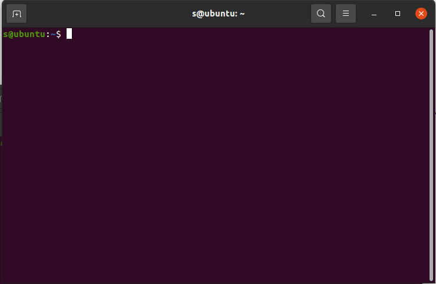
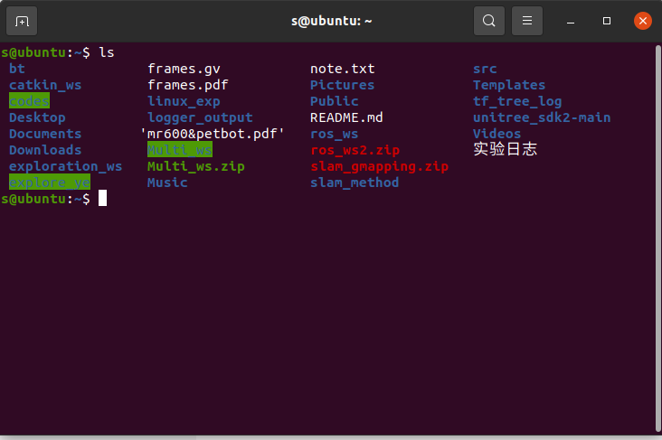
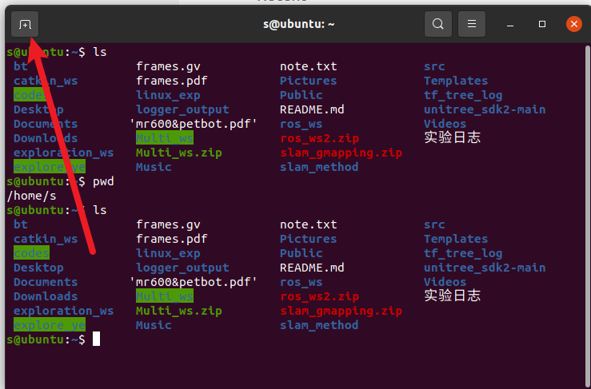

 # Linux Basics Introduction

Linux is an open-source operating system whose kernel was created by Linus Torvalds in 1991.

Many companies and organizations develop their own Linux distributions based on the Linux operating system, such as Google, Red Hat, Ubuntu, etc.

Currently, the ROS system mainly runs on the Ubuntu operating system, which is based on the Debian Linux distribution.

Therefore, if you want to deeply learn and practice robotics, it's best to install the Ubuntu operating system on your computer using [WSL](https://learn.microsoft.com/en-us/windows/wsl/install), or a virtual machine like [VirtualBox](https://www.virtualbox.org/wiki/Downloads) or [VMware](https://www.vmware.com/products/workstation-player.html).

More importantly, most current artificial intelligence environments are based on the Ubuntu operating system, so for learning and practicing robotics, it's best to work in an Ubuntu environment.

## Terminal

First, we need to understand one thing: the terminal.

The terminal is a text interface where users can input commands, and the operating system will execute corresponding operations based on the commands entered by the user.

In the Ubuntu operating system, the terminal is a very important tool. Users can execute various commands in the terminal, such as installing software, configuring the system, running programs, etc.

Press the ctrl key, alt key, and t key simultaneously to summon a terminal interface:


In this image, s is the username, the part after the @ separator is the hostname ubuntu, : is a separator symbol, and ~ represents the current user's home directory, which is also the current path where the terminal is located.

You can input some commands in this black box to perform corresponding operations. For example, input the ls command to list the files and folders in the current directory.

Or input the cd command to switch the current directory. For example, input

```bash
cd ~/ 
```

to switch to the current user's home directory, which is the default path when opening the terminal.



### Linux Basic Commands Mini-Experiment (Follow Step by Step)

#### Experiment Safety Notice (Very Important)

In this experiment, you will encounter **commands that actually modify files and directories**. Please read carefully:

- **`rm` and `mv` directly delete or move files**
- **`rm -rf` is extremely dangerous; once the path is wrong, data cannot be recovered**
- **This experiment only allows operations under `~` (your home directory)**
- **It is strictly forbidden to execute `rm -rf` in system directories such as `/`, `/home`, `/usr`**
- **You will be responsible for repair or compensation costs if the system is damaged due to misoperation**

**Feel free to ask questions if you don't understand**

---

#### I. Experiment Objectives

Through a complete mini-experiment, master the following:

- **Path concepts** in the Linux terminal
- Common file/directory operation commands: `ls mkdir touch cp mv rm find cat`
- Using `gedit` to create and edit files
- Using different methods to execute Python programs, understanding:
  - Relative paths
  - Absolute paths
  - `~` (home directory)
- Understanding basic system and network commands: `ping`, `top`
- Learning to execute a **complete automation script**

---

#### Tips

**Copy and Paste**:
To copy in the terminal, use `ctrl + shift + c`. To paste, use `ctrl + shift + v`. If you press `ctrl + v` in the terminal, invisible characters will appear, and you'll need to press backspace twice to delete them.

**Closing Programs**: In the terminal, close programs using `ctrl + c`, and force terminate programs using `ctrl + z`.

**Adding a New Terminal**: Click the plus sign to add a new terminal:


#### II. Experiment 1: Manual Operations

##### 1. Check Current Location
Confirm you are currently in your **user