## 实验二：ROS 基础与通信机制

### 1. 实验目的

* 理解 ROS 节点（Node）概念
* 掌握话题（Topic）发布-订阅机制
* 掌握服务（Service）请求-响应机制
* 理解 ROS Master 的作用

### 2. ROS 核心概念

#### 2.1 基本组成

* **Node（节点）** ：ROS 系统的基本运行单元，每个节点执行特定任务
* **Topic（话题）** ：节点间通信的命名通道
* **Message Type（消息类型）** ：定义话题上传输的数据格式
* **Master（主节点）** ：提供节点间通信的协调服务（需要 `roscore`）

#### 2.2 通信类型对比

| 通信方式          | 特点             | 使用场景             | 比喻     |
| ----------------- | ---------------- | -------------------- | -------- |
| **Topic**   | 异步，持续数据流 | 传感器数据、状态信息 | 广播电台 |
| **Service** | 同步，请求-响应  | 计算、查询、触发动作 | 打电话   |

### 3. 实验步骤

#### 实验 2.1：体验无通信的孤立程序

```bash#
cd ~/catkin_ws/src/ros_course_examples/simulation_demo
python3 controller.py

# 终端 2：运行 Motor
cd ~/catkin_ws/src/ros_course_examples/simulation_demo
python3 motor.py
```

执行效果如图：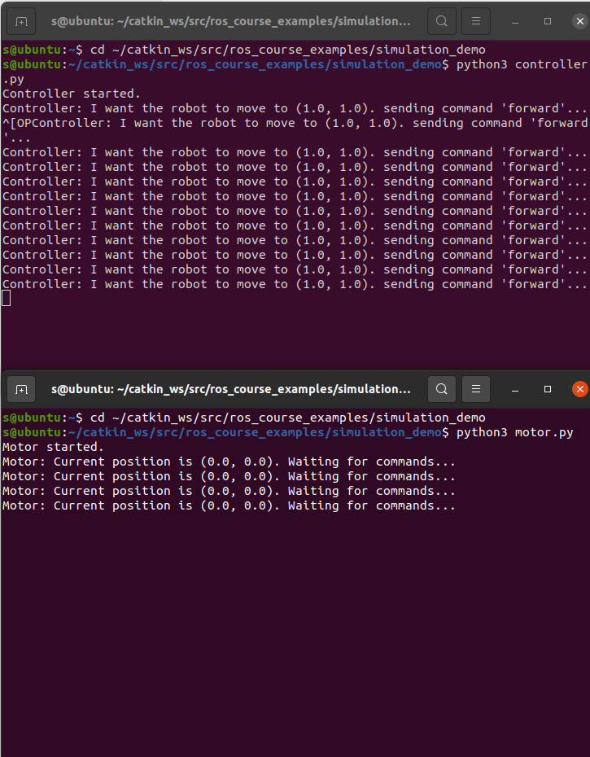

**观察** ：两个程序各自运行，无法相互通信。

关闭这两个程序吧。

#### 实验 2.2：使用 ROS 实现节点通信

我们可以将代码封装成结点，然后基于ROS框架实现结点通信。

首先进行编译

在终端 1：编译ros工作空间

```bash
cd ~/catkin_ws
catkin_make
```

大概的示意图：
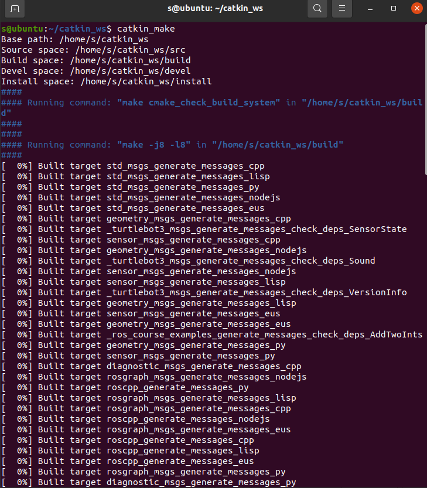

终端 1：启动 ROS Master

```bash
roscore
```

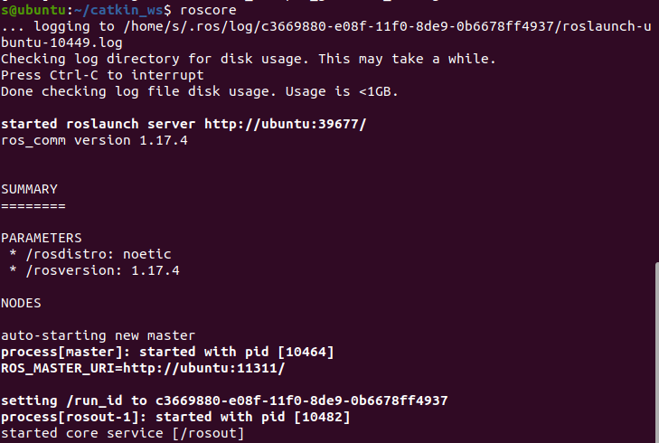

```bash
cd ~/catkin_ws/src/ros_course_examples/nodes/  
chmod +x motor_node.py
chmod +x controller_node.py
```

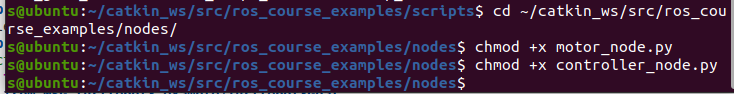

启动通信演示

终端 2：启动电机结点

```bash
cd ~/catkin_ws
source devel/setup.bash
rosrun ros_course_examples motor_node.py
```

你可以发现这个结点（程序）正在等待信息，它的位置并不发生改变。
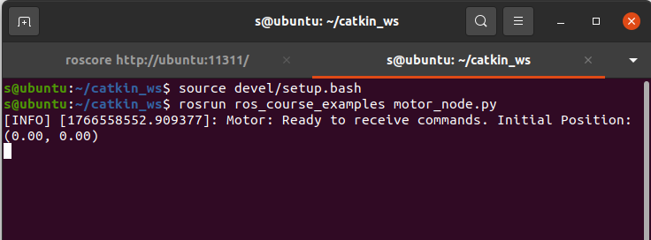

终端 3：启动控制器结点
接下来，让我们控制它

```bash
cd ~/catkin_ws
source devel/setup.bash
rosrun ros_course_examples controller_node.py
```

观察终端，我们可以发现它正在不断的发送指令：
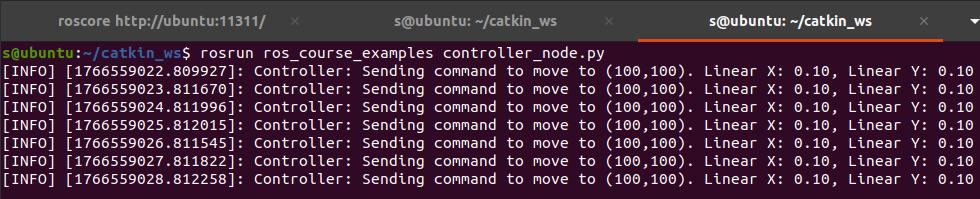

返回查看终端2（电机结点）
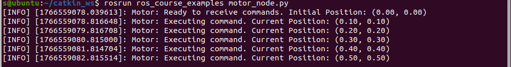

**观察到** ：Controller 发送速度指令，Motor 接收并更新位置。

---

但是，如果每启动一个程序都输入一行指令不会太复杂了吗？

ROS框架中也有自己的“脚本”，可以一键启动多个结点。

关闭终端2和终端3，在终端3中执行：

```bash
cd ~/catkin_ws
source devel/setup.bash
roslaunch ros_course_examples ros_communication_demo.launch
```

你可以观察到，这两个结点都已经启动了。

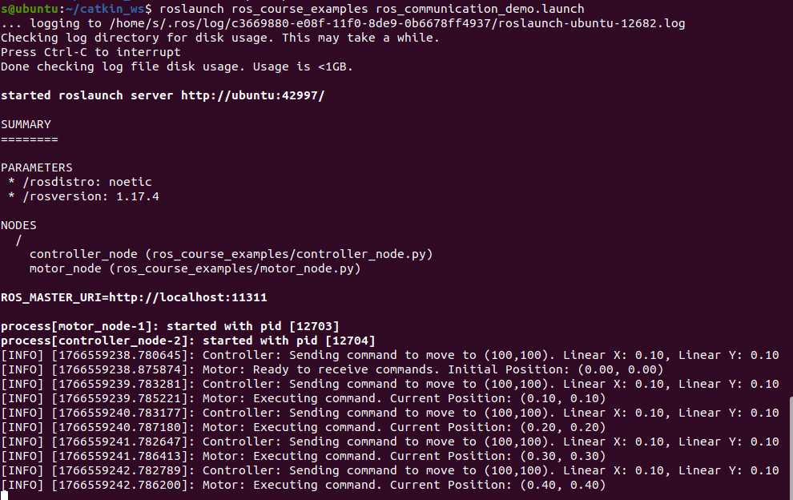

#### 实验 2.3：TurtleSim 通信实验

可以关闭这个程序了（**注意不要关闭roscore的终端**）

终端 2：启动 Turtle 仿真

```bash
rosrun turtlesim turtlesim_node

```

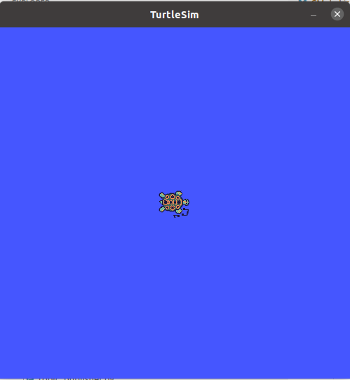

终端 3：启动键盘控制

```bash
rosrun turtlesim turtle_teleop_key
```

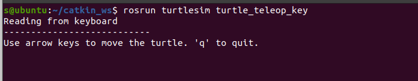

在终端3中按下方向键可以控制turtle运动。
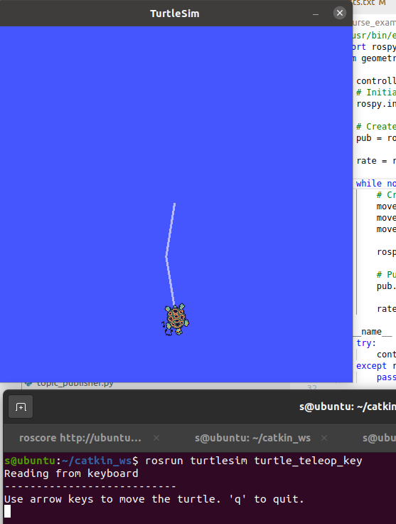

终端 4：可视化通信图

```bash
rqt_graph
```

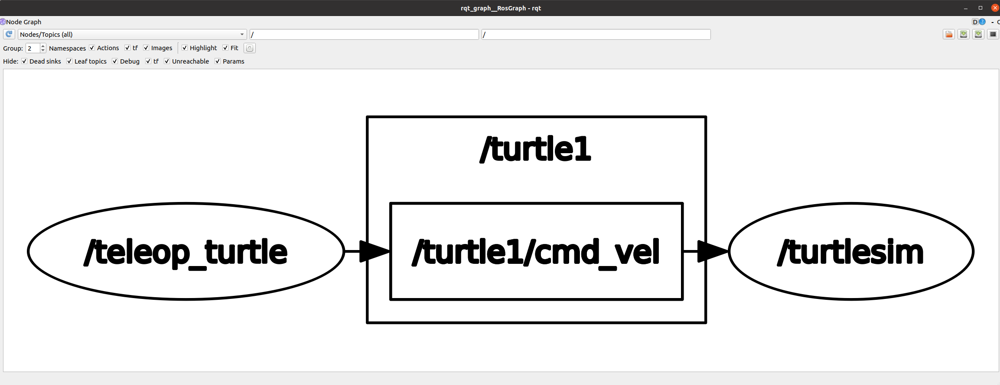

**通信流程分析** ：

1. `turtle_teleop_key` 节点监听键盘输入
2. 发布速度命令到 `/turtle1/cmd_vel` 话题
3. 发布到话题中的信息就是线速度和角速度，消息的类型是 `geometry_msgs/Twist`
4. `turtlesim_node` 订阅 `/turtle1/cmd_vel`
5. 接收速度命令并执行运动

#### 实验 2.4：查看话题信息

以上这些信息都可以通过ros指令来观察到。

```bash
# 列出所有话题
rostopic list
```

```bash
# 查看话题信息
rostopic info /turtle1/cmd_vel
```

```bash
# 查看消息类型定义
rosmsg show geometry_msgs/Twist
```

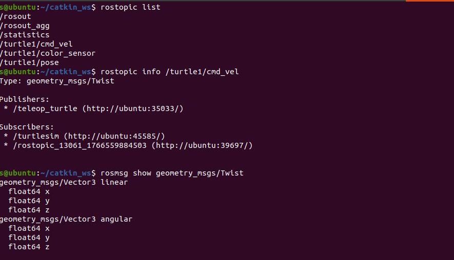

```bash
# 查看话题数据
rostopic echo /turtle1/cmd_vel
```

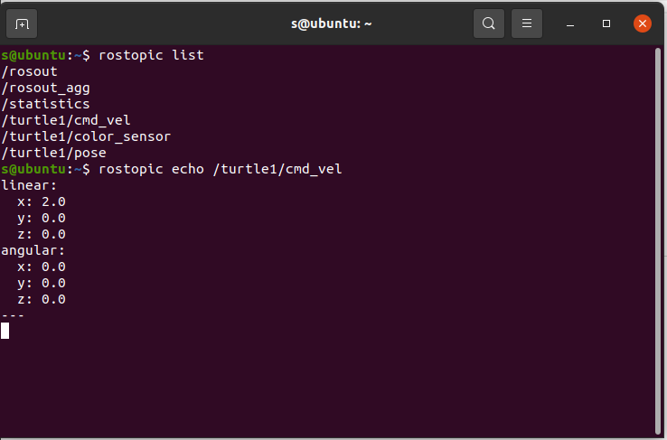

#### 实验 2.5：标准 ROS 通信示例


首先给脚本附上执行权限。

```bash
cd ~/catkin_ws
cd src/ros_course_examples/scripts/
chmod +x run_basic_demo.sh
```


```bash
cd ~/catkin_ws
source devel/setup.bash
rosrun ros_course_examples run_basic_demo.sh
```

 **观察内容** ：

* Talker/Listener：字符串消息传递
* Image Publisher：图像数据传输（在 RViz 中查看）
* Add Two Ints Service：服务调用示例

 **手动调用服务** ：

```bash
source devel/setup.bash
rosrun ros_course_examples add_two_ints_client.py 10 20
```

### 4. 关键代码解析

#### 4.1 话题发布者

```bash
from std_msgs.msg import String

# 初始化节点
rospy.init_node('talker', anonymous=True)

# 创建发布者
pub = rospy.Publisher('chatter', String, queue_size=10)

# 设置频率 10Hz
rate = rospy.Rate(10)

while not rospy.is_shutdown():
    msg = "Hello ROS world"
    pub.publish(msg)
    rate.sleep()
```

#### 4.2 话题订阅者

```bashpython</span></div><code
from std_msgs.msg import String

def callback(msg):
    rospy.loginfo("I heard: %s", msg.data)

# 初始化节点
rospy.init_node('listener', anonymous=True)

# 创建订阅者
rospy.Subscriber('chatter', String, callback)

rospy.spin()  # 保持节点运行
```

#### 4.3 图像发布（易错点）

```bashpython</span></div><code
import cv2

bridge = CvBridge()

# OpenCV 图像转 ROS 消息
# 注意：OpenCV 默认 BGR，需正确指定编码
ros_image = bridge.cv2_to_imgmsg(img, encoding="bgr8")
image_pub.publish(ros_image)
```

⚠️  **常见错误** ：编码参数错误导致颜色反转。

---

## 实验三：Gazebo 仿真环境

### 1. 实验目的

* 掌握 Gazebo 仿真器的使用
* 学会加载和保存仿真世界
* 理解 World 文件结构
* 掌握机器人模型的加载

### 2. Gazebo 核心功能

* **物理引擎** ：模拟真实物理规律（重力、碰撞、摩擦）
* **传感器仿真** ：激光雷达、相机、IMU 等
* **ROS 集成** ：与 ROS 无缝通信
* **可视化** ：3D 场景渲染

### 3. 实验步骤

#### 3.1 启动空白世界

```bash#
gazebo

# 或使用 ROS 启动
roslaunch turtlebot3_gazebo turtlebot3_empty_world.launch
```

#### 3.2 构建自定义场景

1. **插入模型** ：从左侧面板拖拽物体到场景
2. **调整参数** ：

* Position (x, y, z)：位置坐标
* Orientation (roll, pitch, yaw)：姿态角度
* Scale：缩放大小

1. **保存世界** ：`File → Save World As → my_world.world`

#### 3.3 加载自定义世界

```bash#
gazebo my_world.world

# 方法 2：ROS launch 文件
roslaunch turtlebot3_gazebo turtlebot3_world.launch
```

#### 3.4 控制机器人运动

```bash#
roslaunch turtlebot3_teleop turtlebot3_teleop_key.launch
```

 **操作说明** ：

* `W/A/S/D` 或 `方向键`：控制移动
* `X`：停止
* `Q/Z`：增加/减少速度

---

## 实验四：TurtleBot3 运动控制

### 1. 实验目的

* 掌握通过代码控制移动机器人
* 理解线速度和角速度的关系
* 学习里程计（Odometry）数据处理
* 理解四元数与欧拉角转换

### 2. 运动控制原理

#### 2.1 速度命令消息

```bashpython</span></div><code

twist = Twist()
twist.linear.x = 0.2   # 前后速度 (m/s)
twist.linear.y = 0.0   # 左右速度（差速机器人通常为0）
twist.angular.z = 0.5  # 旋转速度 (rad/s)

cmd_vel_pub.publish(twist)
```

#### 2.2 里程计数据订阅

```bashpython</span></div><code

def odom_callback(msg):
    # 获取位置
    x = msg.pose.pose.position.x
    y = msg.pose.pose.position.y
  
    # 获取姿态（四元数）
    orientation = msg.pose.pose.orientation
```

### 3. 实验步骤

#### 3.1 启动形状运动演示

```bashrosrun

```

 **选择运动模式** ：

* `1`：圆形轨迹
* `2`：正方形轨迹
* `3`：长方形轨迹

#### 3.2 观察运动效果

* Gazebo：查看机器人实际运动
* RViz：观察传感器数据和坐标变换

### 4. 关键代码解析

#### 4.1 正方形运动

```bashpython</span></div><code
    side_length = 1.0
    for _ in range(4):
        self.go_straight(side_length)  # 直行1米
        self.turn_90_degrees()         # 转90度
```

#### 4.2 四元数转欧拉角（重点）

```bashpython</span></div><code

def odom_callback(self, msg):
    # 提取四元数
    quaternion = (
        msg.pose.pose.orientation.x,
        msg.pose.pose.orientation.y,
        msg.pose.pose.orientation.z,
        msg.pose.pose.orientation.w
    )
  
    # 转换为欧拉角
    (roll, pitch, yaw) = tf.transformations.euler_from_quaternion(quaternion)
  
    # yaw 是平面机器人的航向角
    self.current_theta = yaw
```

⚠️  **注意事项** ：

* 角度范围：`-π` 到 `π` 或 `0` 到 `2π`
* 处理角度跳变（从 `π` 到 `-π`）
* 开环控制会有累积误差

---

## 实验五：RViz 可视化

### 1. 实验目的

* 掌握 RViz 可视化工具的使用
* 学会添加和配置显示项
* 理解传感器数据的可视化表示
* 掌握界面交互和视角控制

### 2. RViz 可显示的数据类型

* **Robot Model** ：3D 机器人模型
* **LaserScan** ：激光雷达扫描数据
* **PointCloud2** ：3D 点云数据
* **TF** ：坐标系变换关系
* **Image** ：相机图像
* **Odometry** ：里程计轨迹
* **Path** ：规划路径
* **Map** ：占据栅格地图

### 3. RViz 启动方式

#### 方法1：直接启动（需要先运行 roscore）

```bashrviz

```

#### 方法2：使用 TurtleBot3 配置启动（推荐）

```bashroslaunch

```

#### 方法3：加载自定义配置文件

```bashrviz

```

### 4. 实验步骤

#### 4.1 启动仿真和可视化

```bash#
roslaunch turtlebot3_gazebo turtlebot3_world.launch

# 终端 2：启动 RViz
roslaunch turtlebot3_rviz_launchers view_robot.launch
```

#### 4.2 RViz 界面基础操作

##### **视角控制（重要）**

* 🖱️  **鼠标左键拖拽** ：旋转视角
* 🖱️  **鼠标滚轮** ：缩放视图
* 🖱️  **Shift + 左键拖拽** ：平移视图
* 🖱️  **Shift + 滚轮** ：上下平移
* 🖱️  **鼠标中键拖拽** ：平移（某些系统）

##### **界面布局说明**

```bash</span></div><code
│  菜单栏 (File / View / Panels)           │
├──────────┬──────────────────────┬────────┤
│          │                      │        │
│ Displays │   3D 视图窗口         │ 工具栏  │
│ 面板     │   (主显示区域)        │ Views  │
│          │                      │ Time   │
└──────────┴──────────────────────┴────────┘
```

#### 4.3 添加显示项（Display）详细步骤

##### **示例1：添加激光雷达数据**

1. 点击左下角 **"Add"** 按钮
2. 在弹出窗口中选择 **"By display type"** 标签
3. 找到并双击 **"LaserScan"**
4. 在左侧 Displays 面板中展开 **"LaserScan"**
5. 配置参数：
   ```bash</span></div><code
   Topic: /scan           # 点击下拉选择 /scan
   Size (m): 0.05         # 调整点的大小
   Style: Points          # 显示样式
   Color Transformer: Intensity  # 颜色映射
   ```
6. 观察红色扫描点显示障碍物位置

##### **示例2：添加里程计轨迹**

1. 点击 **"Add"** → 选择 **"Odometry"**
2. 配置参数：
   ```bash</span></div><code
   Keep: 100              # 保留 100 条历史轨迹
   Shape: Arrow           # 显示为箭头
   Color: 0; 0; 255       # 蓝色 (RGB)
   Alpha: 1.0             # 不透明度
   Shaft Length: 0.3      # 箭头长度
   ```
3. 机器人移动时会显示蓝色轨迹线

##### **示例3：添加坐标系（TF）**

1. 点击 **"Add"** → 选择 **"TF"**
2. 配置参数：
   ```bash</span></div><code
   ✓ Show Axes           # 显示坐标轴
   ✓ Show Arrows         # 显示箭头
   Marker Scale: 0.5     # 调整坐标轴大小
   Update Interval: 0    # 更新频率（0=最快）
   ```
3. 观察红绿蓝箭头（代表 X/Y/Z 轴）

#### 4.4 常用显示项配置表

| 显示类型             | 推荐话题                   | 作用             | 关键参数                                  |
| -------------------- | -------------------------- | ---------------- | ----------------------------------------- |
| **RobotModel** | (默认)                     | 显示机器人3D模型 | `Robot Description: robot_description`  |
| **LaserScan**  | `/scan`                  | 激光雷达扫描数据 | `Size: 0.05`, `Style: Points`         |
| **Odometry**   | `/odom`                  | 里程计轨迹       | `Keep: 100`, `Shape: Arrow`           |
| **Path**       | `/move_base/global_plan` | 全局规划路径     | `Color: 255;255;0` (黄色)               |
| **TF**         | (无需设置)                 | 坐标系关系       | `Show Names: ✓`, `Marker Scale: 0.5` |
| **Image**      | `/camera/rgb/image_raw`  | 相机图像         | `Transport Hint: raw`                   |
| **Map**        | `/map`                   | 占据栅格地图     | `Color Scheme: map`                     |

#### 4.5 调整 Fixed Frame（参考坐标系）

**什么是 Fixed Frame？**

* RViz 中所有数据的显示都需要一个参考坐标系
* 不同场景需要选择不同的 Fixed Frame

**选择建议**

| 场景           | Fixed Frame   | 效果               |
| -------------- | ------------- | ------------------ |
| 观察机器人运动 | `odom`      | 视角跟随机器人     |
| 查看全局地图   | `map`       | 固定不动的世界视角 |
| 调试传感器     | `base_link` | 视角锁定在机器人上 |

**设置方法**

1. 在顶部 **"Global Options"** 展开
2. 点击 **"Fixed Frame"** 下拉菜单
3. 选择 `odom` 或 `map`

⚠️  **注意** ：如果 Fixed Frame 设置错误，所有显示项会变灰色或不显示。

#### 4.6 观察运动效果的完整流程

**步骤1：准备环境**

```bash#
roslaunch turtlebot3_gazebo turtlebot3_world.launch

# 终端 2：启动 RViz
roslaunch turtlebot3_rviz_launchers view_robot.launch

# 终端 3：运行形状运动
rosrun ros_course_examples run_shape_demo.sh
```

**步骤2：在 RViz 中配置显示**

1. 确认 Fixed Frame 为 `odom`
2. 添加  **Odometry** ，勾选 **Keep**
3. 添加 **LaserScan**
4. 添加 **TF**

**步骤3：观察分析**

* **Gazebo** ：看机器人实际运动（真实物理表现）
* **RViz** ：看传感器数据和坐标系变换（数据层面）
* 对比两者，理解传感器数据与真实环境的关系

#### 4.7 保存和加载配置

**保存配置文件**

```bash</span></div><code
2. File → Save Config As
3. 命名：my_turtlebot_config.rviz
4. 保存到：~/catkin_ws/rviz_configs/
```

**下次使用**

```bashrviz

```

**在 launch 文件中使用**

```bashxml</span></div><code

```

#### 4.8 查看 TF 树

**方法1：在 RViz 中查看**

* 添加 TF 显示项
* 勾选 "Show Names" 和 "Show Axes"
* 观察坐标系之间的层级关系

**方法2：生成 TF 树图（推荐）**

```bash#
rosrun tf2_tools view_frames.py

# 等待 5 秒后自动生成 frames.pdf
evince frames.pdf  # 或用其他 PDF 阅读器打开
```

**TF 树结构示例**

```bash</span></div><code
 └─ odom
     └─ base_footprint
         └─ base_link
             ├─ camera_link
             │   └─ camera_rgb_frame
             ├─ imu_link
             └─ base_scan (laser_link)
```

#### 4.9 监控话题数据

**查看激光扫描数据**

```bashrostopic

```

**查看里程计数据**

```bashrostopic

```

**查看 TF 变换**

```bash#
rosrun tf tf_echo map base_link
```

**查看话题发布频率**

```bashrostopic
rostopic hz /odom
```

### 5. RViz 实用技巧

#### 5.1 性能优化

* 如果 RViz 卡顿，减少 **Keep** 值（历史数据量）
* 降低点云的 **Size** 和 **Alpha**
* 禁用不需要的显示项

#### 5.2 调试技巧

* 使用 **Marker Scale** 调整坐标轴大小，方便观察小物体
* 使用 **Color** 区分不同数据源
* 使用 **Topic** 下拉菜单确认数据是否在发布

#### 5.3 多窗口布局

```bash</span></div><code
View → Camera Type → Top Down Orthographic  # 俯视图
```

### 6. 常见问题排查

| 问题                      | 原因             | 解决方法                           |
| ------------------------- | ---------------- | ---------------------------------- |
| ❌ 显示项变红色/灰色      | 话题未发布       | `rostopic list` 检查话题是否存在 |
| ❌ 看不到机器人模型       | Fixed Frame 错误 | 改为 `odom` 或 `base_link`     |
| ❌ 激光数据不显示         | Topic 选择错误   | 确认为 `/scan`                   |
| ❌ TF 显示 "No transform" | TF 树不完整      | 检查 `rosrun tf view_frames`     |
| ❌ RViz 闪退              | 配置文件损坏     | 删除 `~/.rviz/default.rviz` 重启 |

### 7. 课后练习

1. **基础操作**
   * 启动 TurtleBot3 仿真，在 RViz 中添加所有传感器数据
   * 保存配置文件并验证下次能正常加载
2. **数据分析**
   * 控制机器人走正方形，观察 Odometry 轨迹是否准确
   * 对比 Gazebo 中的实际路径和 RViz 中的里程计轨迹
3. **TF 理解**
   * 生成 TF 树图，理解每个坐标系的作用
   * 使用 `tf_echo` 实时查看 `odom` 到 `base_link` 的变换
4. **进阶挑战**
   * 尝试调整 LaserScan 的颜色映射方式
   * 添加多个 Odometry 显示项，用不同颜色对比不同数据源

---

## 实验六：坐标系与 TF 变换

### 1. 实验目的

* 理解机器人系统中的多坐标系概念
* 掌握 TF（Transform）变换的作用
* 学会查看和分析 TF 树

### 2. 为什么需要多坐标系？

#### 2.1 常见坐标系

* **map** ：全局地图坐标系（固定）
* **odom** ：里程计坐标系（相对固定，有漂移）
* **base_link/base_footprint** ：机器人底盘中心
* **laser_link/camera_link** ：传感器坐标系

#### 2.2 使用场景

| 场景       | 需求                                 | 解决方案                 |
| ---------- | ------------------------------------ | ------------------------ |
| 机器人定位 | 知道机器人在地图中的位置             | map → base_link         |
| 传感器融合 | 将不同传感器数据统一到同一坐标系     | TF 变换                  |
| 目标跟踪   | 将检测到的物体位置转换到机器人坐标系 | camera_link → base_link |

### 3. 实验步骤

#### 3.1 可视化 TF 树

在 RViz 中：

1. 添加 `TF` 显示项
2. 观察红绿蓝箭头（代表 X/Y/Z 轴）
3. 查看坐标系之间的连接关系

#### 3.2 查询 TF 变换

```bash#
rosrun tf tf_echo odom base_link

# 输出示例：
# Translation: [x, y, z]
# Rotation: [x, y, z, w] (四元数)
```

#### 3.3 生成 TF 树图

```bashrosrun
evince frames.pdf
```

### 4. TF 变换代码示例

```bashpython</span></div><code

# 创建 TF 监听器
listener = tf.TransformListener()

# 等待变换可用
listener.waitForTransform('/map', '/base_link', rospy.Time(), rospy.Duration(4.0))

# 查询变换
try:
    (trans, rot) = listener.lookupTransform('/map', '/base_link', rospy.Time(0))
    print("Translation:", trans)
    print("Rotation:", rot)
except (tf.LookupException, tf.ConnectivityException):
    print("TF lookup failed")
```

---

## 实验七：多机协同游戏（进阶）

### 1. 实验目的

* 理解 ROS 多机通信机制
* 掌握 `ROS_MASTER_URI` 和 `ROS_IP` 配置
* 体验分布式机器人系统

### 2. 版本一：单机双控

```bashrosrun

```

* 玩家1：`W/A/S/D`
* 玩家2：`方向键`

### 3. 版本二：多机联调

#### 主机配置（运行 roscore 和 Gazebo）

```bashsource
roslaunch ros_course_examples multi_turtlebot_game.launch
```

#### 从机配置（运行控制节点）

```bash#
source src/ros_course_examples/scripts/setup_slave.sh 192.168.1.100
rosrun ros_course_examples dual_teleop.py
```

#### 网络配置要点

```bash#
export ROS_MASTER_URI=http://localhost:11311
export ROS_IP=192.168.1.100  # 主机实际IP

# 从机环境变量
export ROS_MASTER_URI=http://192.168.1.100:11311
export ROS_IP=192.168.1.101  # 从机实际IP
```

---

## 总结与建议

### 学习路径

1. ✅ Linux 基础 → 熟练使用终端
2. ✅ ROS 通信 → 理解节点、话题、服务
3. ✅ Gazebo 仿真 → 搭建测试环境
4. ✅ RViz 可视化 → 查看传感器数据
5. ✅ TF 坐标系 → 理解空间关系
6. ✅ 运动控制 → 编写控制代码

### 课后练习建议

* 多练习 Linux 命令行操作
* 尝试修改示例代码参数，观察效果
* 使用 `rqt_graph` 和 `rostopic` 工具分析系统
* 阅读 ROS Wiki 官方文档

### 推荐资源

* [ROS Wiki](http://wiki.ros.org/)
* [Gazebo Tutorials](http://gazebosim.org/tutorials)
* [TF Tutorials](http://wiki.ros.org/tf/Tutorials)
