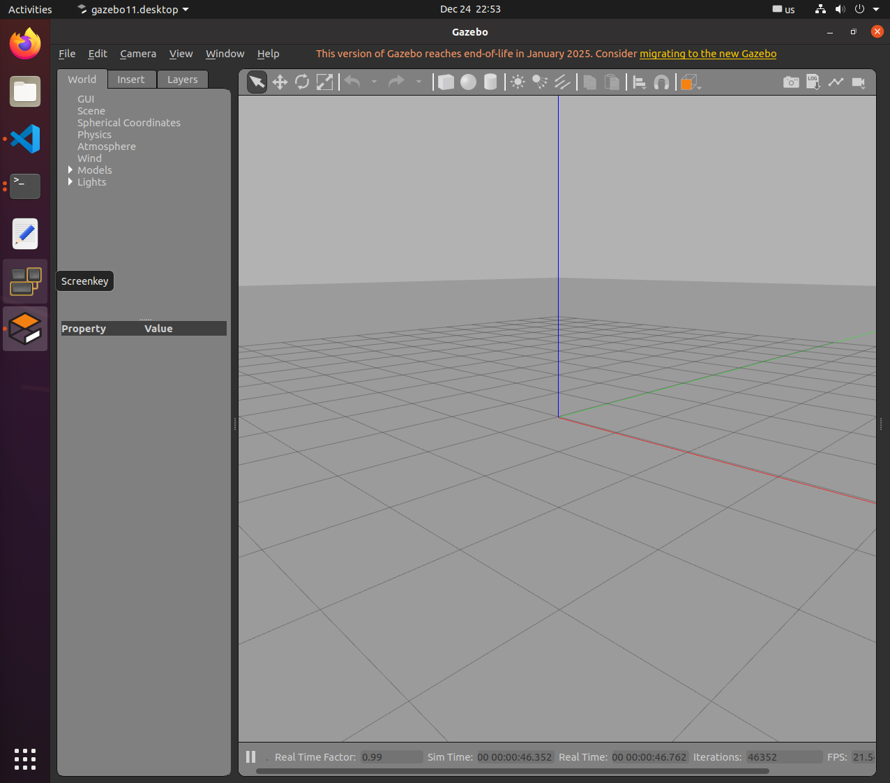
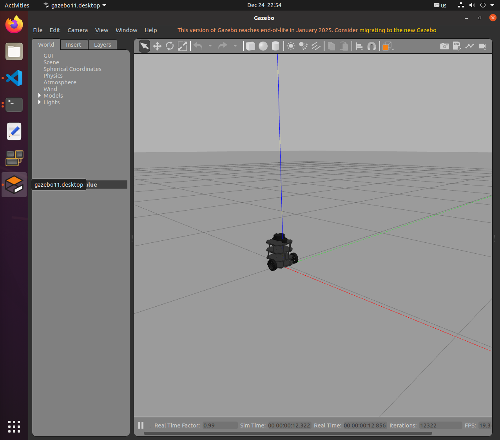
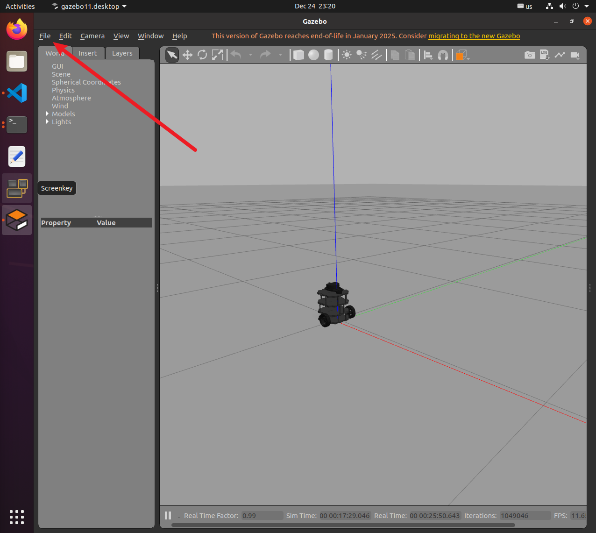
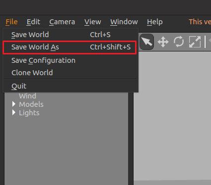
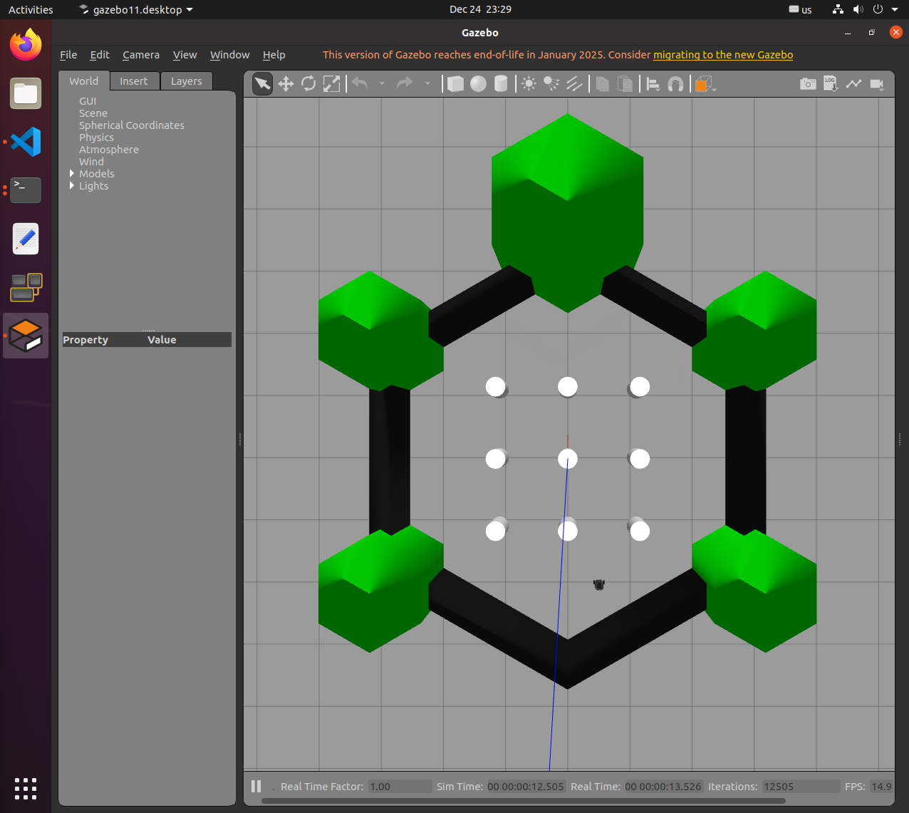
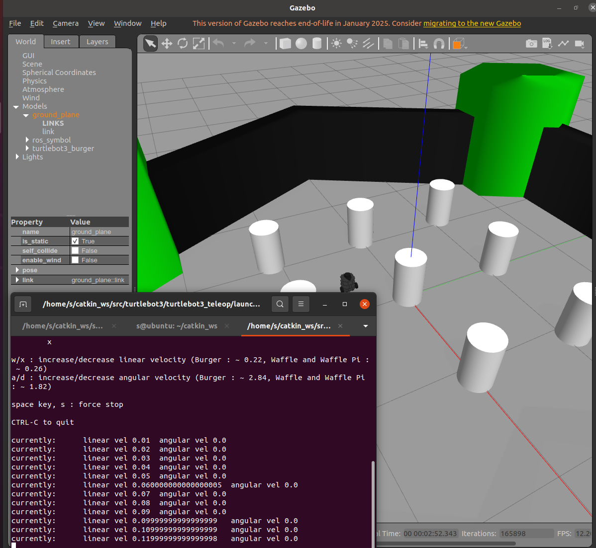
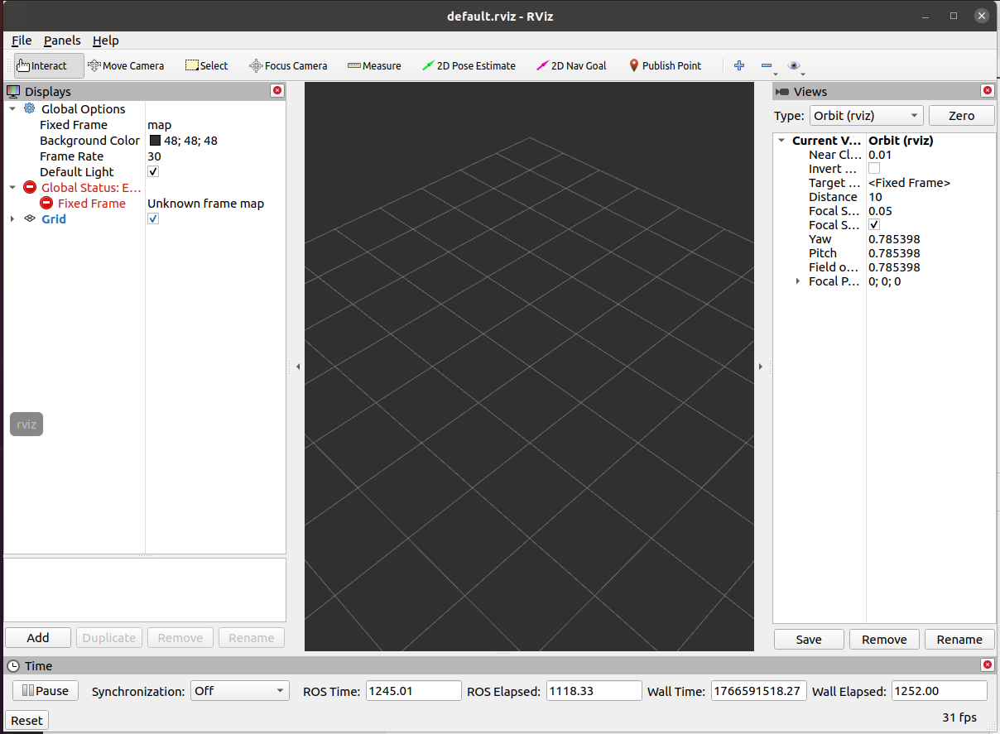

## 实验二：ROS 基础与通信机制

### 1. 实验目的

* 理解 ROS 节点（Node）概念
* 掌握话题（Topic）发布-订阅机制
* 掌握服务（Service）请求-响应机制
* 理解 ROS Master 的作用

### 2. ROS 核心概念

#### 2.1 基本组成

* **Node（节点）** ：ROS 系统的基本运行单元，每个节点执行特定任务
* **Topic（话题）** ：节点间通信的命名通道
* **Message Type（消息类型）** ：定义话题上传输的数据格式
* **Master（主节点）** ：提供节点间通信的协调服务（需要 `roscore`）

#### 2.2 通信类型对比

| 通信方式          | 特点             | 使用场景             | 比喻     |
| ----------------- | ---------------- | -------------------- | -------- |
| **Topic**   | 异步，持续数据流 | 传感器数据、状态信息 | 广播电台 |
| **Service** | 同步，请求-响应  | 计算、查询、触发动作 | 打电话   |

### 3. 实验步骤

#### 实验 2.1：体验无通信的孤立程序

```bash#
# 跳转到主目录: /home/user
cd ~
# 创建catkin_ws文件夹
mkdir catkin_ws
# 将Embodied-AI-Exploration-Lab1下的src文件夹 复制到catkin_ws目录下（path需要配置为Embodied-AI-Exploration-Lab1/src路径）
cp -r path ~/catkin_ws/
例如：
cp -r /home/ht/ht_code/Lab_course/Embodied-AI-Exploration-Lab1/src/ ~/catkin_ws/


cd ~/catkin_ws/src/ros_course_examples/simulation_demo
python3 controller.py

# 终端 2：运行 Motor
cd ~/catkin_ws/src/ros_course_examples/simulation_demo
python3 motor.py
```

执行效果如图：

**观察** ：两个程序各自运行，无法相互通信。

关闭这两个程序吧。

#### 实验 2.2：使用 ROS 实现节点通信

我们已经将代码封装成了ROS结点，文件如下：
`src/ros_course_examples/nodes/motor_node.py`和`src/ros_course_examples/nodes/controller_node.py`。

只要我们启动这两个节点，就可以基于ROS框架实现结点通信。

我们只需要使用一个指令 `rosrun`：
- 功能：运行某个 ROS 包里的一个节点
- 特点：简单、直接、适合测试或调试


首先进行编译

在终端 1：编译ros工作空间

```bash
cd ~/catkin_ws
catkin_make
```

大概的示意图：


终端 1：启动 ROS Master

```bash
roscore
```


```bash
cd ~/catkin_ws/src/ros_course_examples/nodes/  
chmod +x motor_node.py
chmod +x controller_node.py
```


启动通信演示

终端 2：启动电机结点

```bash
cd ~/catkin_ws
source devel/setup.bash
rosrun ros_course_examples motor_node.py
```

你可以发现这个结点（程序）正在等待信息，它的位置并不发生改变。


终端 3：启动控制器结点
接下来，让我们控制它

```bash
cd ~/catkin_ws
source devel/setup.bash
rosrun ros_course_examples controller_node.py
```

观察终端，我们可以发现它正在不断的发送指令：


返回查看终端2（电机结点）


**观察到** ：Controller 发送速度指令，Motor 接收并更新位置。

---

但是，如果每启动一个程序都输入一行指令不会太复杂了吗？

ROS框架中也有自己的“脚本”，可以一键启动多个结点。

关闭终端2和终端3，在终端3中执行：

```bash
cd ~/catkin_ws
source devel/setup.bash
roslaunch ros_course_examples ros_communication_demo.launch
```

你可以观察到，这两个结点都已经启动了。


#### 实验 2.3：TurtleSim 通信实验

可以关闭这个程序了（**注意不要关闭roscore的终端**）

终端 2：启动 Turtle 仿真

```bash
rosrun turtlesim turtlesim_node

```


终端 3：启动键盘控制

```bash
rosrun turtlesim turtle_teleop_key
```


在终端3中按下方向键可以控制turtle运动。


终端 4：可视化通信图

```bash
rqt_graph
```


**通信流程分析** ：

1. `turtle_teleop_key` 节点监听键盘输入
2. 发布速度命令到 `/turtle1/cmd_vel` 话题
3. 发布到话题中的信息就是线速度和角速度，消息的类型是 `geometry_msgs/Twist`
4. `turtlesim_node` 订阅 `/turtle1/cmd_vel`
5. 接收速度命令并执行运动

#### 实验 2.4：查看话题信息

以上这些信息都可以通过ros指令来观察到。

```bash
# 列出所有话题
rostopic list
```

```bash
# 查看话题信息
rostopic info /turtle1/cmd_vel
```

```bash
# 查看消息类型定义
rosmsg show geometry_msgs/Twist
```


```bash
# 查看话题数据
rostopic echo /turtle1/cmd_vel
```


---

## 实验三：Gazebo 仿真环境

### 1. 实验目的

* 掌握 Gazebo 仿真器的使用
* 学会加载和保存仿真世界
* 理解 World 文件结构
* 掌握机器人模型的加载

### 2. Gazebo 核心功能

* **物理引擎** ：模拟真实物理规律（重力、碰撞、摩擦）
* **传感器仿真** ：激光雷达、相机、IMU 等
* **ROS 集成** ：与 ROS 无缝通信
* **可视化** ：3D 场景渲染

### 3. 实验步骤

#### 3.1 启动空白世界

```bash
gazebo
```


或使用 ROS 启动

```bash
source ~/catkin_ws/devel/setup.bash
export TURTLEBOT3_MODEL=burger
roslaunch turtlebot3_gazebo turtlebot3_empty_world.launch
```


#### 3.2 构建自定义场景

1. **插入模型** ：从左侧面板拖拽物体到场景
2. **调整参数** ：

* Position (x, y, z)：位置坐标
* Orientation (roll, pitch, yaw)：姿态角度
* Scale：缩放大小

1. **保存世界** ：`File → Save World As → my_world.world`






#### 3.3 加载自定义世界

```bash
gazebo my_world.world
```

方法 2：ROS launch 文件
```bash
source ~/catkin_ws/devel/setup.bash
export TURTLEBOT3_MODEL=burger
roslaunch turtlebot3_gazebo turtlebot3_world.launch
```


#### 3.4 控制机器人运动

```bash
source ~/catkin_ws/devel/setup.bash
export TURTLEBOT3_MODEL=burger
roslaunch turtlebot3_teleop turtlebot3_teleop_key.launch
```

 **操作说明** ：

* `W/A/S/D` 或 `方向键`：控制移动
* `X`：停止
* `Q/Z`：增加/减少速度




---

## 实验四：RViz 可视化

### 1. 实验目的

* 掌握 RViz 可视化工具的使用
* 学会添加和配置显示项
* 理解传感器数据的可视化表示
* 掌握界面交互和视角控制

### 2. RViz 可显示的数据类型

* **Robot Model** ：3D 机器人模型
* **LaserScan** ：激光雷达扫描数据
* **PointCloud2** ：3D 点云数据
* **TF** ：坐标系变换关系
* **Image** ：相机图像
* **Odometry** ：里程计轨迹
* **Path** ：规划路径
* **Map** ：占据栅格地图

### 3. RViz 启动方式介绍

直接启动

```bash
rviz
```



#### 3.1 RViz 界面基础操作

##### **视角控制**

* 🖱️  **鼠标左键拖拽** ：旋转视角
* 🖱️  **鼠标滚轮** ：缩放视图
* 🖱️  **Shift + 左键拖拽** ：平移视图
* 🖱️  **Shift + 滚轮** ：上下平移
* 🖱️  **鼠标中键拖拽** ：平移（某些系统）


##### **界面布局说明**
```bash
┬──────────────────────────────────────────┬
│  菜单栏 (File / View / Panels)           │
├──────────┬──────────────────────┬────────┤
│          │                      │        │
│ Displays │   3D 视图窗口         │ 工具栏  │
│ 面板     │   (主显示区域)        │ Views  │
│          │                      │ Time   │
└──────────┴──────────────────────┴────────┘
```


### 4. 实验步骤

#### 4.1 启动仿真和可视化

```bash
# 终端 1：启动 gazebo
source ~/catkin_ws/devel/setup.bash
roslaunch turtlebot3_gazebo turtlebot3_world.launch
```

``` bash
# 终端 2：启动 RViz
source ~/catkin_ws/devel/setup.bash
roslaunch turtlebot_rviz_launchers view_robot.launch 
```


#### 4.2 添加显示项（Display）详细步骤

##### **示例1：添加激光雷达数据** (或者直接勾选LaserScan的框框就像，rviz那个laucnh的rviz配置好了)

1. 点击左下角 **"Add"** 按钮

2. 在弹出窗口中选择 **"By display type"** 标签

3. 找到并双击 **"LaserScan"**

4. 在左侧 Displays 面板中展开 **"LaserScan"**

5. 配置参数：
   ```bash</span></div><code
   Topic: /scan           # 点击下拉选择 /scan
   Size (m): 0.05         # 调整点的大小
   Style: Points          # 显示样式
   Color Transformer: Intensity  # 颜色映射
   ```
   
6. 观察红色扫描点显示障碍物位置


##### **示例2：添加里程计轨迹**

1. 点击 **"Add"** → 选择 **"Odometry"**
2. 配置参数：
   ```bash</span></div><code
   Keep: 100              # 保留 100 条历史轨迹
   Shape: Arrow           # 显示为箭头
   Color: 0; 0; 255       # 蓝色 (RGB)
   Alpha: 1.0             # 不透明度
   Shaft Length: 0.3      # 箭头长度
   ```
3. 机器人移动时会显示蓝色轨迹线

##### **示例3：添加坐标系（TF）**

1. 点击 **"Add"** → 选择 **"TF"**

2. 配置参数：
   ```bash</span></div><code
   ✓ Show Axes           # 显示坐标轴
   ✓ Show Arrows         # 显示箭头
   Marker Scale: 0.5     # 调整坐标轴大小
   Update Interval: 0    # 更新频率（0=最快）
   ```
   
3. 观察红绿蓝箭头（代表 X/Y/Z 轴）


#### 4.3 常用显示项配置表

| 显示类型             | 推荐话题                   | 作用             | 关键参数                                  |
| -------------------- | -------------------------- | ---------------- | ----------------------------------------- |
| **RobotModel** | (默认)                     | 显示机器人3D模型 | `Robot Description: robot_description`  |
| **LaserScan**  | `/scan`                  | 激光雷达扫描数据 | `Size: 0.05`, `Style: Points`         |
| **Odometry**   | `/odom`                  | 里程计轨迹       | `Keep: 100`, `Shape: Arrow`           |
| **Path**       | `/move_base/global_plan` | 全局规划路径     | `Color: 255;255;0` (黄色)               |
| **TF**         | (无需设置)                 | 坐标系关系       | `Show Names: ✓`, `Marker Scale: 0.5` |
| **Image**      | `/camera/rgb/image_raw`  | 相机图像         | `Transport Hint: raw`                   |
| **Map**        | `/map`                   | 占据栅格地图     | `Color Scheme: map`                     |

#### 4.4 调整 Fixed Frame（参考坐标系）

**什么是 Fixed Frame？**

* RViz 中所有数据的显示都需要一个参考坐标系
* 不同场景需要选择不同的 Fixed Frame

**选择建议**

| 场景           | Fixed Frame   | 效果               |
| -------------- | ------------- | ------------------ |
| 观察机器人运动 | `odom`      | 视角跟随机器人     |
| 查看全局地图   | `map`       | 固定不动的世界视角 |
| 调试传感器     | `base_link` | 视角锁定在机器人上 |

**设置方法**

1. 在顶部 **"Global Options"** 展开
2. 点击 **"Fixed Frame"** 下拉菜单
3. 选择 `odom` 或 `map`

⚠️  **注意** ：如果 Fixed Frame 设置错误，所有显示项会变灰色或不显示。

#### 4.5 查看 TF 树

**方法1：在 RViz 中查看**

* 添加 TF 显示项
* 勾选 "Show Names" 和 "Show Axes"
* 观察坐标系之间的层级关系

**方法2：查看 TF 树图（推荐）**

```bash

rosrun rqt_tf_tree rqt_tf_tree

```
**查看 TF 变换**


### 6. 常见问题排查

| 问题                      | 原因             | 解决方法                           |
| ------------------------- | ---------------- | ---------------------------------- |
| ❌ 显示项变红色/灰色      | 话题未发布       | `rostopic list` 检查话题是否存在 |
| ❌ 看不到机器人模型       | Fixed Frame 错误 | 改为 `odom` 或 `base_link`     |
| ❌ 激光数据不显示         | Topic 选择错误   | 确认为 `/scan`                   |
| ❌ TF 显示 "No transform" | TF 树不完整      | 检查 `rosrun tf view_frames`     |

---

### 课后练习建议

* 多练习 Linux 命令行操作
* 尝试修改示例代码参数，观察效果
* 使用 `rqt_graph` 和 `rostopic` 工具分析系统
* 阅读 ROS Wiki 官方文档

### 推荐资源

* [ROS Wiki](http://wiki.ros.org/)
* [Gazebo Tutorials](http://gazebosim.org/tutorials)
* [TF Tutorials](http://wiki.ros.org/tf/Tutorials)
