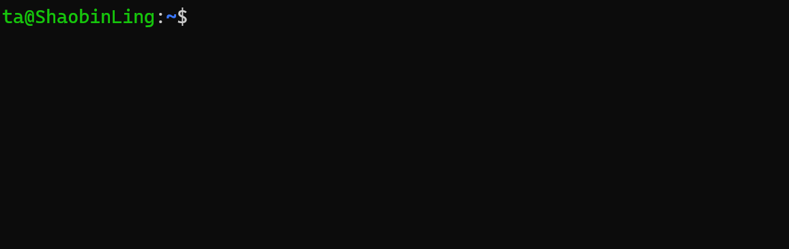

# Linux 入门基础

Linux 是一个开源的操作系统，它的内核是由 Linus Torvalds 于 1991 年创建的。

很多公司和组织都基于 Linux 操作系统，例如 Google、Red Hat、Ubuntu 等，开发自己的 Linux 发行版。

目前ROS系统主要运行在Ubuntu操作系统上，而Ubuntu操作系统是基于Debian Linux发行版的。

所以，如果想要深入学习和实践机器人的话，最好在自己的电脑上安装好Ubuntu操作系统，使用[WSL](https://learn.microsoft.com/en-us/windows/wsl/install)或者虚拟机[VirtualBox](https://www.virtualbox.org/wiki/Downloads) 或者 [VMware](https://www.vmware.com/products/workstation-player.html)。

更重要的是，目前多数的人工智能环境都是基于Ubuntu操作系统的，所以学习和实践机器人的话，最好在Ubuntu环境下进行。

## 终端

首先，我们要认识一个东西：终端。

终端是一个文本界面，用户可以在其中输入命令，操作系统会根据用户输入的命令来执行相应的操作。

在Ubuntu操作系统中，终端是一个非常重要的工具，用户可以在终端中执行各种命令，例如安装软件、配置系统、运行程序等。


同时按下ctrl键,alt键和t键，会召唤出一个终端界面：


在这个图中，ta是用户名，@分隔符后面的部分是主机名（ShaobinLing），: 是分隔符号，~代表着当前用户的主目录也就是当前终端所在的路径。

你可以在这个黑框框里输入一些指令来执行相应的操作，例如输入ls命令来列出当前目录下的文件和文件夹。

或者输入cd命令来切换当前目录，例如输入
``` bash
cd ~/ 
```

来切换到当前用户的主目录。


### Linux 基础指令小实验（跟着一步一步做）

####  实验安全须知（非常重要）

在本实验中你将接触到**会真实修改文件和目录的指令**，请务必认真阅读：

- **`rm`、`mv` 会直接删除或移动文件**
- **`rm -rf` 极其危险，一旦路径写错，数据无法恢复**
- **本实验只允许在 `~`（你的主目录）下操作**
- **严禁在 `/`、`/home`、`/usr` 等系统目录执行 `rm -rf`**
- **因误操作导致系统损坏，需要自行承担维修或赔偿责任**

**不懂可以随时提问**

---

#### 一、实验目标

通过一个完整的小实验，掌握以下内容：

- Linux 终端中的 **路径概念**
- 常见文件/目录操作指令  
  `ls mkdir touch cp mv rm find cat`
- 使用 `gedit` 创建和编辑文件
- 使用不同方式执行 Python 程序，理解：
  - 相对路径
  - 绝对路径
  - `~`（home 目录）
- 了解基本系统与网络指令：`ping`、`top`
- 学会执行一个 **完整自动化脚本**

---

#### 快捷键提示
**复制粘贴**：
如果想在终端进行复制使用 ` ctrl + shift + c`，如果想使用粘贴可以使用 `ctrl + shift + v`。如果在终端中按下 ` ctrl + v` 将会有不显示的字符，需要你按两下回退键进行删除。

**关闭程序**：在终端中关闭程序使用`ctrl + c`，强行终止程序使用`ctrl + z`。

#### 二、实验一：手动操作

##### 1 查看当前位置

```bash
pwd
ls
```

确认你当前在自己的 **home 目录（~）** 下。

---

##### 2 创建实验工作区

```bash
mkdir linux_exp
cd linux_exp
ls
```

---

##### 3 创建文件和目录

```bash
mkdir src
touch note.txt
ls
```

---

##### 4 使用 gedit 创建 Python 文件

```bash
gedit src/hello.py
```
注意需要`ctrl + s`保存一下

在打开的编辑器中输入并保存：

```python
print("Hello Linux")
```

---

##### 5 使用 find 查找文件

```bash
find ~ -name "hello.py"
```

观察输出路径。

---

##### 6 查看文件内容

```bash
cat src/hello.py
```

---

##### 7 复制、移动、删除文件（谨慎）

```bash
cp src/hello.py hello_copy.py
mv hello_copy.py hello_moved.py
rm hello_moved.py
ls
```

注意 **不要使用 `rm -rf /` 或乱删目录**

---

#### 三、实验二：执行 Python，理解路径

确保你仍在 `~/linux_exp` 目录下：

```bash
pwd
```

##### 方式一：相对路径

```bash
python3 src/hello.py
```

---

##### 方式二：home 路径

```bash
python3 ~/linux_exp/src/hello.py
```

---

##### 方式三：绝对路径

```bash
python3 /home/<用户名>/linux_exp/src/hello.py
```

> 请将 `<用户名>` 替换为当前终端的用户名，即@前面的字符串


---

##### 思考

- 为什么三种方式都能运行？
- 如果你 `cd ~` 之后，哪些还能用？

---

#### 四、实验三：系统与网络指令（观察即可）

##### 查看进程（按 q 退出）

```bash
top
```

---

##### 测试网络（Ctrl + C 停止）

```bash
ping baidu.com
```

---

#### 五、实验四：一键自动化脚本（重点）

我们可以写一个脚本，自动从互联网上获取今天深圳的天气以及执行上面我们写的Python代码。

##### 1️⃣ 创建脚本文件

```bash
cd ~/linux_exp    
gedit run_linux_exp.sh
```

写入以下内容并保存：

```bash
#!/bin/bash

echo "=== Linux 基础实验脚本：自动执行Python 文件 ==="
python3 ~/linux_exp/src/hello.py

echo "=== Linux 基础实验脚本：获取当天天气 ==="
# 定义要查询的城市（可修改为你的城市，如北京、上海、Guangzhou，支持中英文）
CITY="深圳"

# 输出提示信息
echo "======================================"
echo "      今日天气查询（来自 wttr.in）"
echo "======================================"

# 从wttr.in获取天气信息并格式化输出
curl -s "wttr.in/${CITY}?format=3"  # 极简输出（城市：天气 温度）
# 脚本结束提示
echo -e "\n======================================"
echo "              查询完成"
echo "======================================"

```

---

##### 2️⃣ 添加执行权限

```bash
chmod +x run_linux_exp.sh
```

---

##### 3️⃣ 执行脚本

```bash
./run_linux_exp.sh
```

我们可以看到脚本是特别厉害的工具，它通过linux指令就能完成非常多的任务。

---

#### 六、实验总结

你在本实验中实际使用并理解了：

##### 📌 三种路径写法

- **绝对路径**  
  `/home/<用户名>/linux_exp/src/hello.py`

- **相对路径**  
  `src/hello.py`

- **home 路径**  
  `~/linux_exp/src/hello.py`

👉 **命令是否成功，取决于：你在哪 + 你怎么写路径**

---

#### 七、检查清单（自检）

- [ ] 我知道 `pwd` 在干什么  
- [ ] 我不会随便用 `rm -rf`  
- [ ] 我能看懂脚本里每一行命令  
- [ ] 我理解为什么同一个 Python 文件可以用多种方式执行  


#### 八、linux指令相关学习资源

- [linux-command-manual](https://www.runoob.com/linux/linux-command-manual.html)
- [geeksforgeeks - Linux Commands](https://www.geeksforgeeks.org/linux-unix/linux-commands/)
- [The Linux command line for beginners](https://ubuntu.com/tutorials/command-line-for-beginners#1-overview)

---


# ROS 机器人实验手册

本手册旨在指导学生完成 ROS 基础通信、机器人运动控制、多机协同及自主追踪等实验。通过本课程，学生将深入体验和理解 ROS 的节点通信机制（话题、服务）、坐标系转换（TF）以及 Gazebo 仿真环境的使用。

---

## 实验一：ROS 基础通信体验

### 1. 实验目的
*   体验程序（进程）通信的概念
*   理解 ROS 节点（Node）的概念。
*   掌握话题（Topic）通信机制：发布者（Publisher）与订阅者（Subscriber）。
*   掌握服务（Service）通信机制：服务端（Server）与客户端（Client）。
*   体验图像数据在 ROS 中的传递。

### 2. 实验步骤

#### 2.1 体验无通信的孤立程序（Python 原生模拟）

首先，我们模拟两个独立的程序：一个是控制器（Controller），负责发出移动指令；另一个是电机（Motor），负责执行移动并报告位置。

1.  **运行 Controller**
    打开一个新的终端，运行：
    ```bash
    cd ~/catkin_ws/src/ros_course_examples/simulation_demo
    python3 controller.py
    ```
    *   **现象**：你会看到它一直在喊：“Controller: I want the robot to move to (1.0, 1.0)...”，并尝试发送指令。

2.  **运行 Motor**
    打开另一个新的终端，运行：
    ```bash
    cd ~/catkin_ws/src/ros_course_examples/simulation_demo
    python3 motor.py
    ```
    *   **现象**：你会看到它一直在说：“Motor: Current position is (0.0, 0.0)”，完全没有移动。

**结论**：
你可以发现无法传递消息。
而 ROS 正是机器人模块之间的通信工具。
做一个比喻，ROS就是机器人身上的神经系统，链接着自己每个部分的算法，也可以链接着别的机器人。

#### 2.2 使用 ROS 实现节点通信

关闭掉以上两个终端（在相应终端上同时按下ctrl键和c键），我们使用 ROS 将这两个程序封装成**节点（Node）**，并利用 ROS 的通信机制让它们“对话”。

1. **启动 ROS Core**
    在终端A中运行以下命令：
    ``` bash
    roscore
    ```

2.  **启动 ROS 节点**
    在终端中运行以下命令（我们已经为你准备好了封装后的 ROS 节点和启动脚本）：
    ```bash
    cd ~/catkin_ws
    source devel/setup.bash
    roslaunch ros_course_examples ros_communication_demo.launch
    ```
    .launch文件是ros框架内的脚本，可以一键启动多个ros结点，把整个机器人框架给启动了。
2.  **观察现象**
    *   你将看到两个节点同时启动。
    *   **Controller Node** 会发布速度指令（`linear.x=0.1`, `linear.y=0.1`）。
    *   **Motor Node** 会接收指令，并实时更新打印自己的坐标：`(0.10, 0.10) -> (0.20, 0.20) -> ...`
    *   这证明了两个独立的进程通过 ROS 成功进行了数据交换！

#### 2.3 进阶体验：标准 ROS 示例

接下来，我们可以体验一个更完整的 ROS 标准示例（Talker/Listener 和 图像传输）。


1.  **启动实验**
    在终端中运行以下命令：
    ```bash
    cd ~/catkin_ws
    source devel/setup.bash
    rosrun ros_course_examples run_basic_demo.sh
    ```
2.  **观察现象**
    *   **终端输出**：你会看到 `talker` 节点在发布 "Hello ROS world"，`listener` 节点在接收并打印。
    *   **RViz 窗口**：左下角会显示一个绿色的动态圆环图像，这是通过 ROS 话题传输的 OpenCV 生成图像。
    *   **服务调用**：你可以打开一个新的终端，尝试手动调用加法服务：
        ```bash
        cd ~/catkin_ws
        source devel/setup.bash
        # 语法: rosrun ros_course_examples add_two_ints_client.py <num1> <num2>
        rosrun ros_course_examples add_two_ints_client.py 10 20
        ```
        你应该能看到返回结果 `30`。

### 3. 实验原理
*   **话题 (Topic)**：一种异步通信方式，用于连续数据流（如传感器数据、日志）。发布者只管发，订阅者只管收，互不等待。
*   **服务 (Service)**：一种同步通信方式，用于请求/响应模式（如“计算这两个数的和”、“拍一张照片”）。客户端发送请求后会等待服务端处理完毕并返回结果。

### 4. 关键代码讲解
*   **发布者 (`nodes/topic_publisher.py`)**
    ```python
    # 创建发布者：话题名 'chatter'，消息类型 String，队列大小 10
    pub = rospy.Publisher('chatter', String, queue_size=10)
    # 设置频率 10Hz
    rate = rospy.Rate(10)
    ```
    *   **注意**：`queue_size` 很重要，如果发送太快处理太慢，队列满了会丢弃旧消息。

*   **图像发布 (`nodes/image_publisher.py`)**
    ```python
    # 使用 CvBridge 将 OpenCV 图片转换为 ROS 消息
    bridge = CvBridge()
    ros_image = bridge.cv2_to_imgmsg(img, "bgr8")
    image_pub.publish(ros_image)
    ```
    *   **易错点**：OpenCV 默认是 BGR 格式，而 ROS 中有时默认为 RGB，转换参数 `"bgr8"` 必须正确，否则颜色会反转（红变蓝）。

---

## 实验二：Turtlebot 运动控制与可视化

### 1. 实验目的
*   学会通过代码控制移动机器人（发送 `cmd_vel`）。
*   理解线速度（Linear）和角速度（Angular）的关系。
*   掌握 RViz 可视化工具的使用（LaserScan, RobotModel, TF）。
*   理解里程计（Odometry）和四元数（Quaternion）。

### 2. 实验步骤
1.  **启动实验**
    ```bash
    rosrun ros_course_examples run_shape_demo.sh
    ```
2.  **选择形状**
    根据终端提示输入数字：
    *   `1`: 圆形移动
    *   `2`: 正方形移动
    *   `3`: 长方形移动
3.  **观察 RViz**
    *   你将看到机器人在移动，同时雷达扫描到的红点（墙壁）也会随之移动。
    *   观察 `TF` 坐标系（红绿蓝箭头），理解 `odom`（里程计坐标系）和 `base_footprint`（机器人底盘坐标系）之间的关系。

### 3. 实验原理
*   **运动控制**：通过向 `/cmd_vel` 话题发布 `geometry_msgs/Twist` 消息。
    *   `linear.x`: 前后移动速度 (m/s)
    *   `angular.z`: 左右旋转速度 (rad/s)
*   **闭环与开环**：本实验演示的是简单的**开环控制**（基于时间或简单的里程计反馈），机器人可能会走歪，这是正常的，精确控制需要 PID 算法。

### 4. 关键代码讲解 (`nodes/move_turtlebot.py`)
*   **走正方形逻辑**
    ```python
    def move_square(self):
        side_length = 1.0
        # 走四条边
        for _ in range(4):
            self.go_straight(side_length) # 直行
            self.turn_90_degrees()        # 旋转90度
    ```
*   **坐标转换 (四元数转欧拉角)**
    ```python
    # 里程计消息中，方向是四元数(x,y,z,w)，人类难以直观理解
    # 需要转换为欧拉角(roll, pitch, yaw)，平面移动主要关注 yaw (偏航角)
    quaternion = (msg.pose.pose.orientation.x, ...)
    euler = tf.transformations.euler_from_quaternion(quaternion)
    self.current_theta = euler[2] # 获取 yaw
    ```
    *   **重要**：角度处理时要注意 `0` 到 `2*pi` 或 `-pi` 到 `pi` 的跳变问题。

---

## 实验三：双人/多机追捕游戏

### 1. 实验目的
*   **版本一（单机双控）**：体验多机器人协同仿真，理解共享资源的竞争（键盘控制）。
*   **版本二（多机通信）**：**核心重点**，理解 ROS `MASTER_URI` 和 `ROS_IP` 的配置，实现跨设备通信。

### 2. 实验步骤
#### 版本一：本地双人游戏
1.  **启动**
    ```bash
    rosrun ros_course_examples run_game_v1.sh
    ```
2.  **操作**
    *   **玩家 1 (Prey/被追者)**：使用键盘 `W/A/S/D` 控制 Robot 1。
    *   **玩家 2 (Chaser/追捕者)**：使用键盘 `方向键 (↑/↓/←/→)` 控制 Robot 2。
    *   **规则**：当两车距离小于 1 米时，游戏结束，裁判节点会锁定所有机器人。

#### 版本二：多机联调 (两台电脑)
1.  **网络设置**：确保两台电脑在同一局域网下（能互相 ping 通）。
2.  **主机 (运行 roscore 和 Gazebo)**：
    ```bash
    # 在主机终端运行
    source src/ros_course_examples/scripts/setup_master.sh
    roslaunch ros_course_examples multi_turtlebot_game.launch
    ```
3.  **从机 (运行控制节点)**：
    ```bash
    # 在从机终端运行 (假设主机IP为 192.168.1.100)
    source src/ros_course_examples/scripts/setup_slave.sh 192.168.1.100
    rosrun ros_course_examples dual_teleop.py
    ```
4.  **现象**：从机可以通过键盘控制主机 Gazebo 中的机器人，证明 ROS 消息成功跨网络传输。

### 3. 关键代码讲解 (`nodes/dual_teleop.py`)
*   **多机控制原理**
    ```python
    # 分别创建两个发布者，发布到不同机器人的命名空间下
    pub1 = rospy.Publisher('/tb3_0/cmd_vel', Twist, queue_size=1)
    pub2 = rospy.Publisher('/tb3_1/cmd_vel', Twist, queue_size=1)
    ```
    *   **注意**：在多机系统中，命名空间（Namespace）至关重要，用于区分同类型的不同实体。

---
