# Linux Basics Introduction

Linux is an open-source operating system whose kernel was created by Linus Torvalds in 1991.

Many companies and organizations develop their own Linux distributions based on the Linux operating system, such as Google, Red Hat, Ubuntu, etc.

Currently, the ROS system mainly runs on the Ubuntu operating system, which is based on the Debian Linux distribution.

Therefore, if you want to deeply learn and practice robotics, it's best to install the Ubuntu operating system on your computer using [WSL](https://learn.microsoft.com/en-us/windows/wsl/install), or a virtual machine like [VirtualBox](https://www.virtualbox.org/wiki/Downloads) or [VMware](https://www.vmware.com/products/workstation-player.html).

More importantly, most current artificial intelligence environments are based on the Ubuntu operating system, so for learning and practicing robotics, it's best to work in an Ubuntu environment.

## Terminal

First, we need to understand one thing: the terminal.

The terminal is a text interface where users can input commands, and the operating system will execute corresponding operations based on the commands entered by the user.

In the Ubuntu operating system, the terminal is a very important tool. Users can execute various commands in the terminal, such as installing software, configuring the system, running programs, etc.

Press the ctrl key, alt key, and t key simultaneously to summon a terminal interface:


In this image, s is the username, the part after the @ separator is the hostname ubuntu, : is a separator symbol, and ~ represents the current user's home directory, which is also the current path where the terminal is located.

You can input some commands in this black box to perform corresponding operations. For example, input the ls command to list the files and folders in the current directory.

Or input the cd command to switch the current directory. For example, input

```bash
cd ~/ 
```

to switch to the current user's home directory, which is the default path when opening the terminal.


### Linux Basic Commands Mini-Experiment (Follow Step by Step)

#### Experiment Safety Notice (Very Important)

In this experiment, you will encounter **commands that actually modify files and directories**. Please read carefully:

- **`rm` and `mv` directly delete or move files**
- **`rm -rf` is extremely dangerous; once the path is wrong, data cannot be recovered**
- **This experiment only allows operations under `~` (your home directory)**
- **It is strictly forbidden to execute `rm -rf` in system directories such as `/`, `/home`, `/usr`**
- **You will be responsible for repair or compensation costs if the system is damaged due to misoperation**

**Feel free to ask questions if you don't understand**

---

#### I. Experiment Objectives

Through a complete mini-experiment, master the following:

- **Path concepts** in the Linux terminal
- Common file/directory operation commands: `ls mkdir touch cp mv rm find cat`
- Using `gedit` to create and edit files
- Using different methods to execute Python programs, understanding:
  - Relative paths
  - Absolute paths
  - `~` (home directory)
- Understanding basic system and network commands: `ping`, `top`
- Learning to execute a **complete automation script**

---

#### Tips

**Copy and Paste**:
To copy in the terminal, use `ctrl + shift + c`. To paste, use `ctrl + shift + v`. If you press `ctrl + v` in the terminal, invisible characters will appear, and you'll need to press backspace twice to delete them.

**Closing Programs**: In the terminal, close programs using `ctrl + c`, and force terminate programs using `ctrl + z`.

**Adding a New Terminal**: Click the plus sign to add a new terminal:


#### II. Experiment 1: Manual Operations

##### 1. Check Current Location

Confirm you are currently in your **user directory (~)**.

```bash
pwd
ls
```

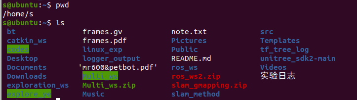

---

##### 2. Create Experiment Workspace

```bash
mkdir linux_exp
cd linux_exp
ls
```

You can observe that the path before the $ symbol has changed.
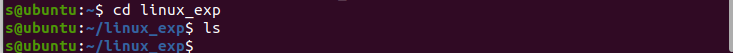

---

##### 3. Create Files and Directories

In Windows, we use right-click to create files/folders, and in the terminal, we have corresponding commands:

```bash
mkdir src
touch note.txt
ls
```

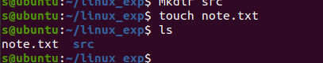

---

##### 4. Use gedit to Create a Python File

gedit is a text editor:

```bash
gedit src/hello.py
```

In the opened editor, input and save:

```python
print("Hello Linux")
```

The effect is shown below:

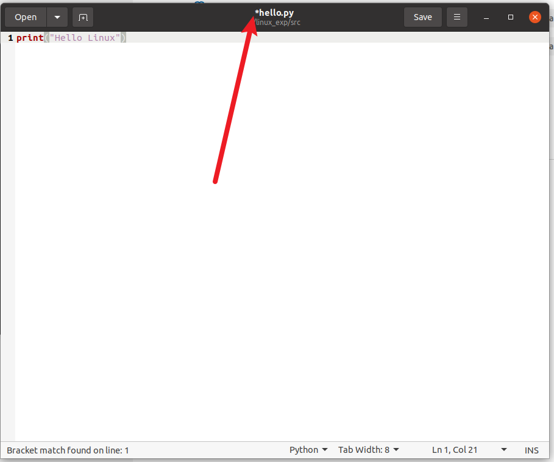

Note that you need to save with `ctrl + s`. The * symbol here indicates there are unsaved modifications.

After saving, the effect is as shown:
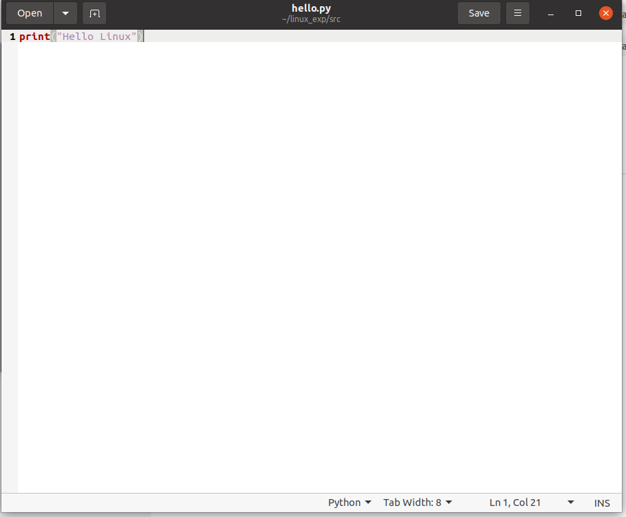

Click the terminal icon on the left.
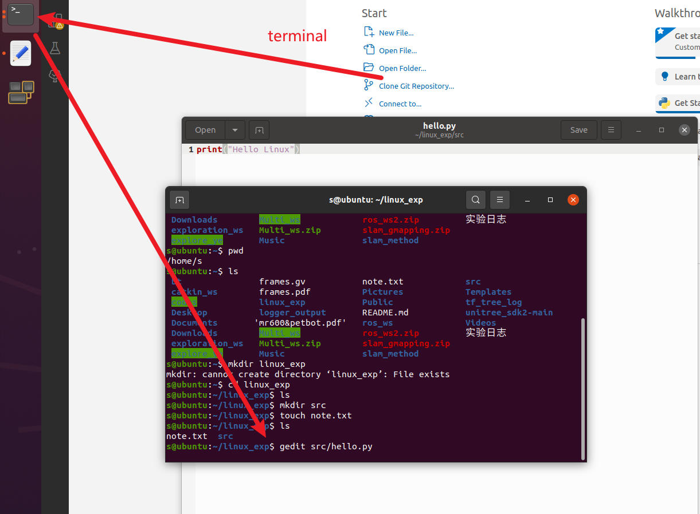

You can see that below the gedit command, there is no new place to input commands.
This is because the gedit text editor is running. You can press `ctrl` and `c` simultaneously in the terminal to close it.

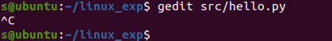

---

##### 5. Use find to Search for Files

We can search for files we want in folders

```bash
find ~ -name "hello.py"
```

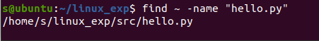

You can observe the path of this file. It starts with `/`, meaning this is an absolute path.

---

##### 6. View File Contents

```bash
cat src/hello.py
```

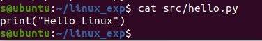

---

##### 7. Copy, Move, Delete Files (Use Caution)

Copy

```bash
cp src/hello.py hello_copy.py
ls
```

Move/Rename

```bash
mv hello_copy.py hello_moved.py
ls
```

Delete

```bash
rm hello_moved.py
ls
```

You can observe the effects of these commands on files.

Note: **Do not use `rm -rf /` or randomly delete directories**

---

#### III. Experiment 2: Execute Python, Understand Paths

Make sure you are still in the `~/linux_exp` directory:

```bash
pwd
```

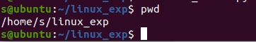

##### Method 1: Relative Path

```bash
python3 src/hello.py
```

---

##### Method 2: Home Path

```bash
python3 ~/linux_exp/src/hello.py
```

---

##### Method 3: Absolute Path

```bash
python3 /home/<username>/linux_exp/src/hello.py
```

> Please replace `<username>` with the current terminal username, which is the string before @

---

##### Reflection

- Why do all three methods work?
- After you `cd ~`, which ones will still work?

---

#### IV. Experiment 3: System and Network Commands (Observation Only)

##### View Processes (Press q to exit)

```bash
top
```

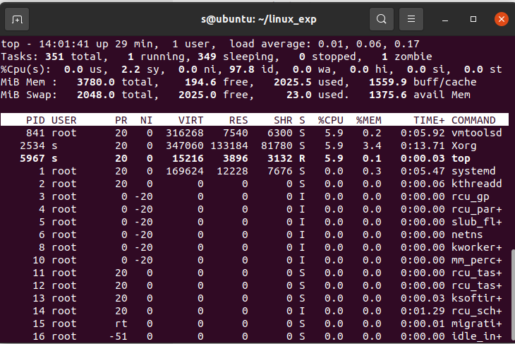

---

##### Test Network (Ctrl + C to stop)

Sometimes we use this command to test whether the host can access the internet.

```bash
ping baidu.com
```

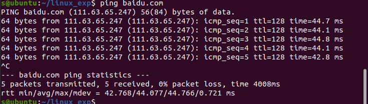

---

#### V. Experiment 4: One-Click Automation Script (Key Point)

We can write a script to automatically get today's weather in Shenzhen from the internet and execute the Python code we wrote above.

##### 1️⃣ Create Script File

```bash
cd ~/linux_exp  
gedit run_linux_exp.sh
```

Write the following content and save:

```bash
#!/bin/bash

echo "=== Linux Basic Experiment Script: Automatically Execute Python File ==="
python3 ~/linux_exp/src/hello.py

echo "=== Linux Basic Experiment Script: Get Today's Weather ==="
# Define the city to query (can be modified to your city, such as Beijing, Shanghai, Guangzhou; supports Chinese and English)
CITY="Shenzhen"

# Output prompt information
echo "======================================"
echo "      Today's Weather Query (from wttr.in)"
echo "======================================"

# Get weather information from wttr.in and format output
curl -s "wttr.in/${CITY}?format=3"  # Minimal output (City: Weather Temperature)
# Script completion prompt
echo -e "\n======================================"
echo "              Query Complete"
echo "======================================"

```

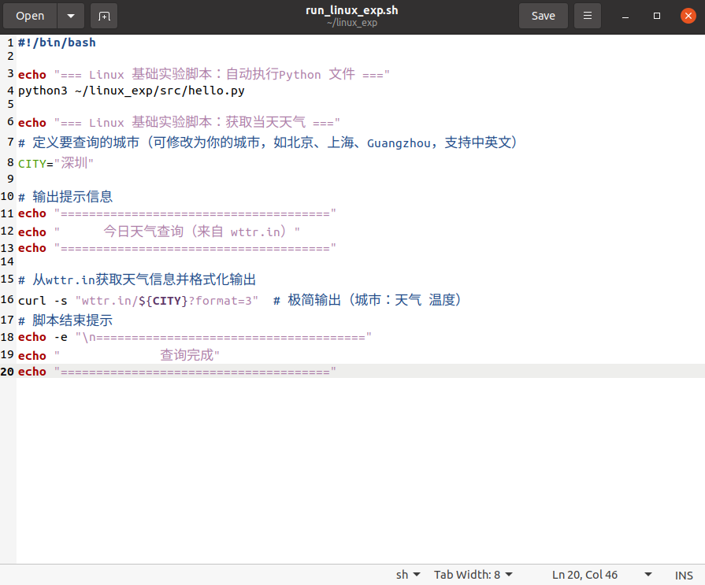

---

##### 2️⃣ Add Execute Permission

```bash
chmod +x run_linux_exp.sh
```

---

##### 3️⃣ Execute Script

```bash
./run_linux_exp.sh
```

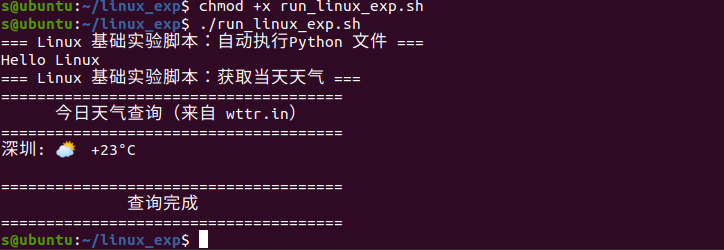

We can see that scripts are particularly powerful tools that can accomplish many tasks through Linux commands.

---

#### VI. Experiment Summary

In this experiment, you actually used and understood:

##### 📌 Three Path Writing Methods

- **Absolute path** `/home/<username>/linux_exp/src/hello.py`
- **Relative path** `src/hello.py`
- **Home path** `~/linux_exp/src/hello.py`

👉 **Whether a command succeeds depends on: where you are + how you write the path**

---

#### VII. Checklist (Self-Check)

- [ ] I know what `pwd` does
- [ ] I won't randomly use `rm -rf`
- [ ] I can understand every line of commands in the script
- [ ] I understand why the same Python file can be executed in multiple ways

#### VIII. Linux Command Learning Resources

- [linux-command-manual](https://www.runoob.com/linux/linux-command-manual.html)
- [geeksforgeeks - Linux Commands](https://www.geeksforgeeks.org/linux-unix/linux-commands/)
- [The Linux command line for beginners](https://ubuntu.com/tutorials/command-line-for-beginners#1-overview)


# Experiment 2: ROS Basics and Communication Mechanisms

## 1. Experiment Objectives

* Understand the concept of ROS Nodes
* Master the Topic publish-subscribe mechanism
* Understand the role of the ROS Master

## 2. Core ROS Concepts

### 2.1 Basic Components

* **Node** : The basic operational unit of a ROS system; each node performs a specific task.
* **Topic** : A named channel for communication between nodes.
* **Master** : Provides coordination services for communication between nodes (requires `roscore`).

### 2.2 Node Communication

The most common way nodes communicate is based on topics. A publisher node names a topic and publishes messages to it. Another subscriber node subscribes to that topic.
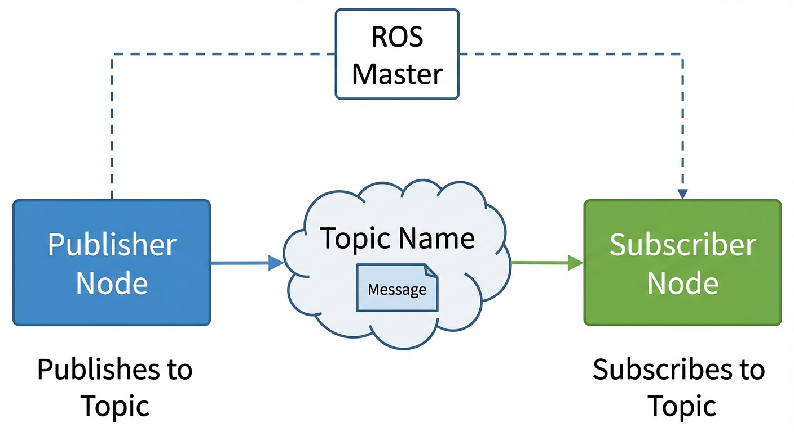

## 3. Experiment Steps

First, download the course code repository from GitHub and rename it to catkin_ws.

```bash
git clone https://github.com/AB-pixel-pixel/Embodied-AI-Exploration-Lab1.git
mv Embodied-AI-Exploration-Lab1 catkin_ws
cd catkin_ws
```

### Experiment 2.1: Running two isolated programs

```bash
cd ~/catkin_ws/src/ros_course_examples/simulation_demo
python3 controller.py
```

```bash
# Terminal 2: Run Motor
cd ~/catkin_ws/src/ros_course_examples/simulation_demo
python3 motor.py
```

Execution result shown in the figure:

 

 **Observation** : The two programs run independently and cannot communicate with each other.

Close these two programs now.

### Experiment 2.2: Implementing Node Communication using ROS

We have already encapsulated the code into ROS nodes, the files are as follows:
`src/ros_course_examples/nodes/motor_node.py` and `src/ros_course_examples/nodes/controller_node.py`.

As long as we start these two nodes, we can achieve node communication based on the ROS framework.

First, perform compilation.

In Terminal 1: Compile the ROS workspace.

We use the `catkin_make` command to compile ROS packages. Its functions are:

* Compile source code: Compile C++ source files into executables, mark Python scripts as executable.
* Handle dependencies: Automatically resolve and link dependencies between packages.
* Generate configuration files: Create environment configuration scripts such as devel/setup.bash.
* Build message types: Compile custom msg, srv, and action files.

```bash
cd ~/catkin_ws
catkin_make
```

Rough schematic:


After execution it will:

* Compile code in the build/ directory.
* Output results to the devel/ directory.
* Generate environment variables usable by ROS.

Terminal 1: Start the ROS Master node.

The `roscore` command can start the Master node:

* Function: Manages registration and discovery of all nodes.
* Role: Allows Publishers and Subscribers to find each other.
* Analogy: Like a central server, connecting nodes.
* **Note: During the experiment, we do not close the terminal running roscore.**

```bash
roscore
```


Grant execution permissions to the node code:

```bash
cd ~/catkin_ws/src/ros_course_examples/nodes/  
chmod +x motor_node.py
chmod +x controller_node.py
```


**Start Communication Demo**

Since we need to use the ROS framework, we need to use ROS commands to start the code instead of simply using python commands.

This is the `rosrun` command:

* Function: Run a node within a ROS package.
* Features: Simple, direct, suitable for testing or debugging.
* Example usage:

```bash
# rosrun <ros package name> <executable file name>
rosrun turtlesim turtlesim_node
```

* If the executable file requires arguments, they can also follow directly: rosrun pkg exe arg1 arg2 ...

Terminal 2: Start the motor node.

**Note: `source devel/setup.bash` helps ros commands find corresponding executable files.**

```bash
cd ~/catkin_ws
source devel/setup.bash
rosrun ros_course_examples motor_node.py
```

You will see that this node (program) is waiting for information, and its position does not change.


Terminal 3: Start the controller node.
Next, let's control it.

```bash
cd ~/catkin_ws
source devel/setup.bash
rosrun ros_course_examples controller_node.py
```

Observing the terminal, we can discover that it is constantly sending commands:


Return to view Terminal 2 (Motor node).


**Observed**:The Controller sends speed commands, and the Motor receives them and updates the position.

---

However, wouldn't it be too complicated to enter a command line every time a program is started?

ROS provides a unified startup configuration mechanism that can start multiple nodes with one click; this is the `roslaunch` command.

`roslaunch`:

* Function: Start multiple nodes at once through .launch files.
* Set parameters for nodes, for example, setting parameters for relevant planning algorithms according to the size of the robot.
* Remap topics, suitable for changing communication relationships without changing code.
* Set namespaces, suitable for multiple robots using the same code.
* Launch files are usually located in the launch/ directory of the package (not mandatory, but convention).
* Example:

```bash
# roslaunch <ros package name> <launch file name within package>
roslaunch turtlesim turtlesim_demo.launch
```

Close Terminal 2 and Terminal 3, execute in Terminal 3:

```bash
cd ~/catkin_ws
source devel/setup.bash
roslaunch ros_course_examples ros_communication_demo.launch
```

You can observe that both nodes have started.


Before proceeding to the following experiments, you can close this program first ( **Note: do not close the terminal running roscore** ).

### Experiment 2.3: TurtleSim Communication Experiment

Terminal 2: Start Turtle Simulation

```bash
rosrun turtlesim turtlesim_node
```


Terminal 3: Start Keyboard Control

```bash
rosrun turtlesim turtle_teleop_key
```


Pressing arrow keys in Terminal 3 can control the turtle movement.


Terminal 4: Visualize Communication Graph

```bash
rqt_graph
```


 **Communication Process Analysis** :

1. `turtle_teleop_key` node listens for keyboard input.
2. Publishes speed commands to the `/turtle1/cmd_vel` topic.
3. The information published to the topic is linear speed and angular speed; the message type is `geometry_msgs/Twist`.
4. `turtlesim_node` subscribes to `/turtle1/cmd_vel`.
5. Receives speed commands and executes movement.

### Experiment 2.4: Viewing Topic Information

All the above information can be observed through ROS commands.

```bash
# List all topics
rostopic list
```

```bash
# View topic information
rostopic info /turtle1/cmd_vel
```

```bash
# View message type definition
rosmsg show geometry_msgs/Twist
```


```bash
# View topic data
rostopic echo /turtle1/cmd_vel
```


---

# Experiment 3: Gazebo Simulation Environment

## 1. Experiment Objectives

* Master the use of the Gazebo simulator
* Learn to load and save simulation worlds
* Understand the World file structure
* Master the loading of robot models
* Message Type

## 2. Gazebo Core Functions

* **Physics Engine** : Simulates real physical laws (gravity, collisions, friction).
* **Sensor Simulation** : LiDAR, cameras, IMU, etc.
* **ROS Integration** : Seamless communication with ROS.
* **Visualization** : 3D scene rendering.

## 3. Experiment Steps

### 3.1 Start Empty World

```bash
gazebo
```


Or start using ROS

```bash
source ~/catkin_ws/devel/setup.bash
export TURTLEBOT3_MODEL=waffle
roslaunch turtlebot3_gazebo turtlebot3_empty_world.launch
```


### 3.2 Build Custom Scene

1. **Insert Models** : Drag objects from the left panel into the scene.
2. **Adjust Parameters** :

* Position (x, y, z): Position coordinates
* Orientation (roll, pitch, yaw): Attitude angles
* Scale: Zoom size

1. **Save World** : `File -> Save World As -> my_world.world`


### 3.3 Load Custom World

```bash
gazebo my_world.world
```

Method 2: ROS launch file

```bash
source ~/catkin_ws/devel/setup.bash
export TURTLEBOT3_MODEL=waffle
roslaunch turtlebot3_gazebo turtlebot3_world.launch
```


### 3.4 Control Robot Movement

```bash
source ~/catkin_ws/devel/setup.bash
export TURTLEBOT3_MODEL=waffle
roslaunch turtlebot3_teleop turtlebot3_teleop_key.launch
```

 **Operating Instructions** :

* `W/A/S/D` or `Arrow Keys`: Control movement
* `X`: Stop
* `Q/Z`: Increase/decrease speed


---

# Experiment 4: RViz Visualization

## 1. Experiment Objectives

* Master the use of the RViz visualization tool
* Learn to add and configure display items
* Understand visual representation of sensor data
* Master interface interaction and viewpoint control

## 2. Data Types Displayable by RViz

* **Robot Model** : 3D robot model
* **LaserScan** : LiDAR scan data
* **PointCloud2** : 3D point cloud data
* **TF** : Coordinate system transformation relationships
* **Image** : Camera images
* **Odometry** : Odometry trajectory
* **Path** : Planned path
* **Map** : Occupancy grid map

## 3. Introduction to RViz Startup Methods

Start directly

```bash
rviz
```


### 3.1 Basic RViz Interface Operations

#### **Viewpoint Control**

* **Left mouse drag** : Rotate view
* **Mouse wheel** : Zoom view
* **Shift + Left drag** : Pan view
* **Shift + Wheel** : Pan up/down
* **Middle mouse drag** : Pan (some systems)

## 4. Experiment Steps

### 4.1 Start Simulation and Visualization

```bash
# Terminal 1: Start gazebo
source ~/catkin_ws/devel/setup.bash
roslaunch turtlebot3_gazebo turtlebot3_world.launch
```

```bash
# Terminal 2: Start RViz
source ~/catkin_ws/devel/setup.bash
roslaunch turtlebot_rviz_launchers view_robot.launch 
```

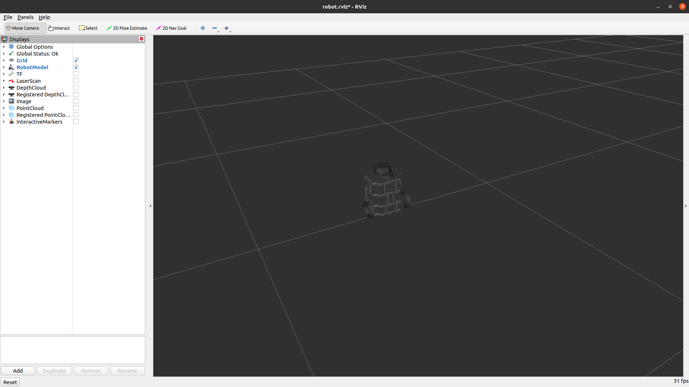

### 4.2 Detailed Steps to Add Display Items (Display)

#### **Example 1: Adding LiDAR Data** (Or just check the LaserScan box, like if the rviz launch already configured rviz)

1. Click the **"Add"** button in the bottom left corner.
2. Select the **"By display type"** tab in the pop-up window.
3. Find and double-click  **"LaserScan"** .
4. Expand **"LaserScan"** in the left Displays panel.
5. Configure parameters:

```bash
   Topic: /scan           # Click dropdown to select /scan
   Size (m): 0.05         # Adjust point size
   Style: Points          # Display style
   Color Transformer: Intensity  # Color map
```

6. Observe red scan points displaying obstacle positions.


#### **Example 2: Adding Coordinate Systems (TF)**

1. Click **"Add"** -> Select  **"TF"** .
2. Configure parameters:

```bash
     Show Axes           # Show axes
     Show Arrows         # Show arrows
   Marker Scale: 0.5     # Adjust axes size
   Update Interval: 0    # Update interval (0=fastest)
```

3. Observe red, green, and blue arrows (representing X/Y/Z axes).


### 4.3 Configuration Table for Common Display Items

| Display Type         | Recommended Topic   | Function                        | Key Parameters                           |
| -------------------- | ------------------- | ------------------------------- | ---------------------------------------- |
| **RobotModel** | (Default)           | Displays 3D robot model         | `Robot Description: robot_description` |
| **LaserScan**  | `/scan`           | LiDAR scan data                 | `Size: 0.05`,`Style: Points`         |
| **Odometry**   | `/odom`           | Odometry trajectory             | `Keep: 100`,`Shape: Arro`            |
| **TF**         | (No setting needed) | Coordinate system relationships | `Show Names:  `,`Marker Scale: 0.5`  |
| **Map**        | `/map`            | Occupancy grid map              | `Color Scheme: map`                    |

### 4.4 Adjust Fixed Frame (Reference Coordinate System)

**What is Fixed Frame?**

* The display of all data in RViz requires a reference coordinate system.
* Different scenarios require selecting different Fixed Frames.

**Selection Suggestions**

| Scenario                 | Fixed Frame   | Effect                          |
| ------------------------ | ------------- | ------------------------------- |
| Observing robot movement | `odom`      | Viewpoint follows robot         |
| Debugging sensors        | `base_link` | Viewpoint locked onto the robot |

**Setting Method**

1. Expand **"Global Options"** at the top.
2. Click the **"Fixed Frame"** dropdown menu.
3. Select `odom`.

 **Note** : If Fixed Frame is set incorrectly, all display items will turn gray or not show.

### 4.5 View TF Tree

**Command to view TF tree diagram**

```bash
rosrun rqt_tf_tree rqt_tf_tree
```

**View TF Transforms**


## 6. Common Troubleshooting

| Issue                       | Cause                | Solution                               |
| --------------------------- | -------------------- | -------------------------------------- |
| Display items turn red/gray | Topic not published  | `rostopic list`Check if topic exists |
| Cannot see robot model      | Fixed Frame error    | Change to `odom` or `base_link`    |
| Laser data does not show    | Wrong Topic selected | Confirm it is `/scan`                |
| TF shows "No transform"     | TF tree incomplete   | Check `rosrun tf view_frames`        |

---

## Suggestions for After-class Practice

* Practice Linux command-line operations more.
* Try modifying sample code parameters and observe the effects.
* Use `rqt_graph` and `rostopic` tools to analyze the system.
* Read the official ROS Wiki documentation.

## Recommended Resources

* [ROS Wiki](http://wiki.ros.org/)
* [Gazebo Tutorials](http://gazebosim.org/tutorials)
* [TF Tutorials](http://wiki.ros.org/tf/Tutorials)
