# Lab 2: ROS Perception System Basics — Image Subscription and Processing

## 1. Experiment Objectives

- Learn how to subscribe to and process image data (RGB and Depth) in ROS.
- Master basic image processing techniques using OpenCV: Color Space Conversion (HSV), Object Detection, and Contour Detection.
- Understand how to calculate 3D coordinates of objects using Depth maps and Camera Intrinsics.
- Learn to transform coordinates from the Camera Frame to the Robot Base Frame using TF.
- Implement a basic Visual Servoing control loop to follow a target.
- Visualize 3D Point Clouds using Open3D.


## 2. Setup and Compilation

First, ensure your environment is set up and the package is compiled.

```bash
# 1. Navigate to your workspace
cd ~/catkin_ws

# 2. Build the package
# We whitelist only this package to speed up compilation
catkin_make -DCATKIN_WHITELIST_PACKAGES="lab2_perception"

# 3. Source the setup script to register the new package
source devel/setup.bash

# 4. Grant execution permissions
chmod +x ~/catkin_ws/src/lab2_perception/tools/*.py
chmod +x ~/catkin_ws/src/lab2_perception/scripts/*.py
```

## 3. Step-by-Step Experiment

### Part 1: Start simulation

Before diving into complex processing, let's verify we can receive images from the camera.

**1.1 Run Simulation**

```bash
# Terminal 1: Start ROS Master (if not running)
roscore
```


``` bash
# Terminal 2: Start a robot simulation
source ~/catkin_ws/devel/setup.bash
export TURTLEBOT3_MODEL=waffle
roslaunch turtlebot3_gazebo turtlebot3_empty_world.launch
```


**1.2 Run rviz to visualize rgb and depth image**

Open RViz and add image displays for both RGB and depth topics.

```bash
# Terminal 3: Run RViz
rviz
```

In RViz:
Click Add → By display type → Image


Use `rostopic list` to check the camera topic name.


Set the topic to /camera/rgb/image_raw


Add another Image display and set the topic to /camera/depth/image_raw
Adjust the Fixed Frame (e.g., camera_link or base_link) if needed
This allows you to visually inspect both the RGB stream and the depth map in real time.


**1.3 Spawn an obstacle/object for detection**

Set a green cube for object detection:

```bash
source ~/catkin_ws/devel/setup.bash
rosrun gazebo_ros spawn_model \
  -file ~/catkin_ws/src/lab2_perception/demo_images/green_cube.sdf \
  -sdf \
  -model green_cube
```


---

### Part 2: Image Processing Tools (HSV Tuning)

To detect a specific object (like a green block), we need to find the correct HSV (Hue, Saturation, Value) thresholds. We have provided tools to help you with this.

**2.1 Generate Test Images**
First, let's generate some sample images to test our algorithm.

```bash
# Generate dummy images in src/lab2_perception/demo_images/
rosrun lab2_perception generate_images.py
```

**2.2 Tune HSV Thresholds**
Use the tuner tool to find the best values to isolate the green color.

```bash
# Run the tuner tool
rosrun lab2_perception hsv_tuner.py
```

**Instructions**:

- Adjust `H Min`, `S Min`, `V Min`, etc., until only the desired object is white in the middle mask window.
- `Esc` will exit the program.
- **Record these values**. You will need them for the main perception node. (Default values for green are already set in the code)

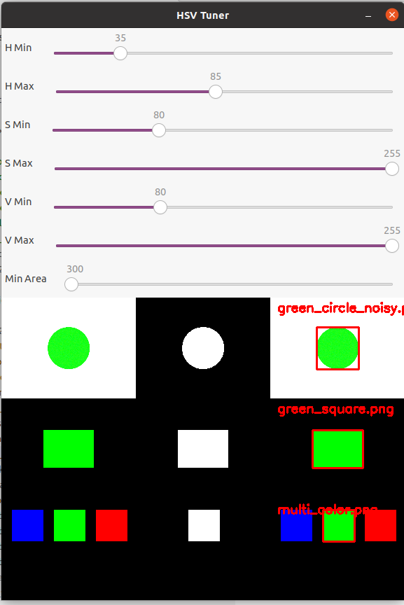


**2.3 Get camera param**

``` bash
rostopic echo /camera/rgb/camera_info
```

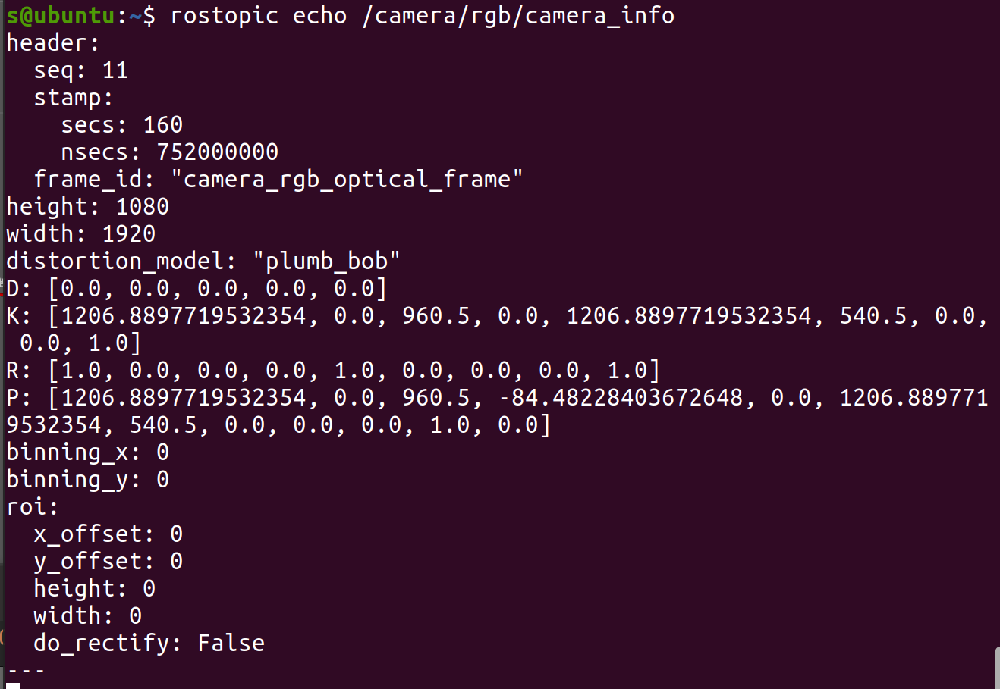


This parameter is critical for calculating the correct object coordinates.

This parameter will be loaded autonomously in the perception node.

---

### Part 3: Integrated Perception & Visual Servoing

This is the core of the experiment. We will run the TurtleBot3 simulation in Gazebo. The robot will use its camera to detect a green object, calculate its 3D position, and drive towards it.

**3.1 Launch Simulation and Perception Node**

We have prepared a launch file that starts:

- Gazebo with TurtleBot3.
- The `perception_node` (performs detection and control).
- RViz for visualization.

```bash
# Close previous terminals if needed, then run:
# Terminal 1 start simulation
source ~/catkin_ws/devel/setup.bash
export TURTLEBOT3_MODEL=waffle
roslaunch turtlebot3_gazebo turtlebot3_empty_world.launch
```

```bash
# Terminal 2 start perception node
source ~/catkin_ws/devel/setup.bash
roslaunch lab2_perception lab2.launch
```

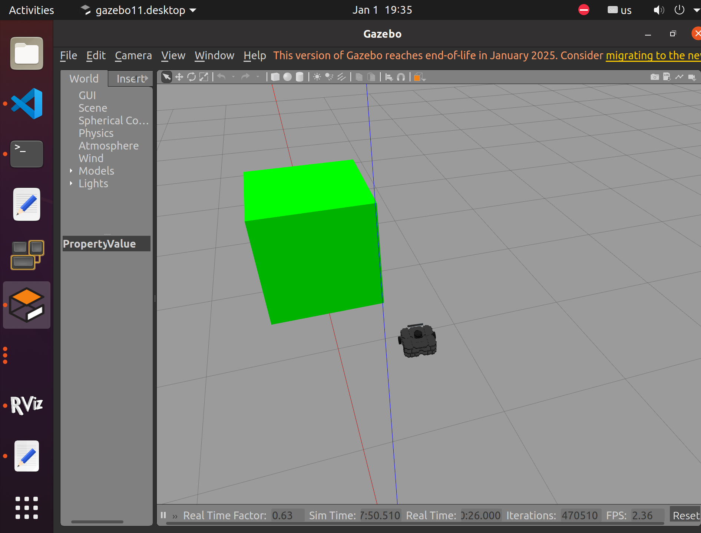
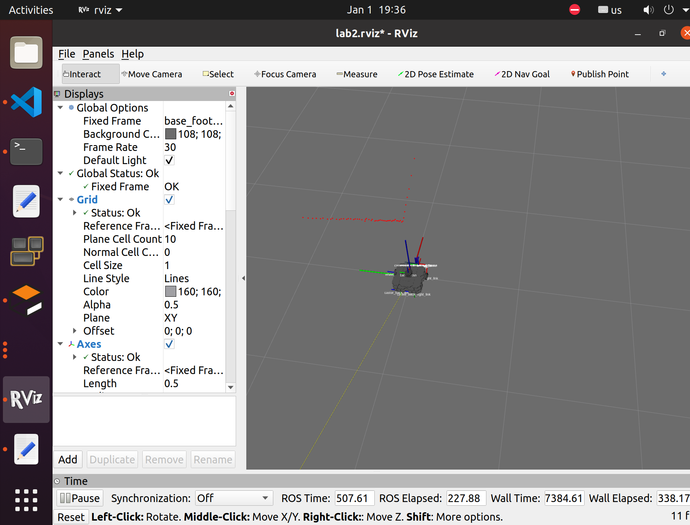


To stop the robot immediately, press Ctrl+C in the terminal running the perception node, or lift the robot (if real) / reset simulation (if Gazebo).

Use the HSV values (H_min, S_min, V_min, etc.) you recorded in Part 2 to update the parameters in the rqt_reconfigure window.
```bash
rosrun rqt_reconfigure rqt_reconfigure
```

Set the threshold like this:

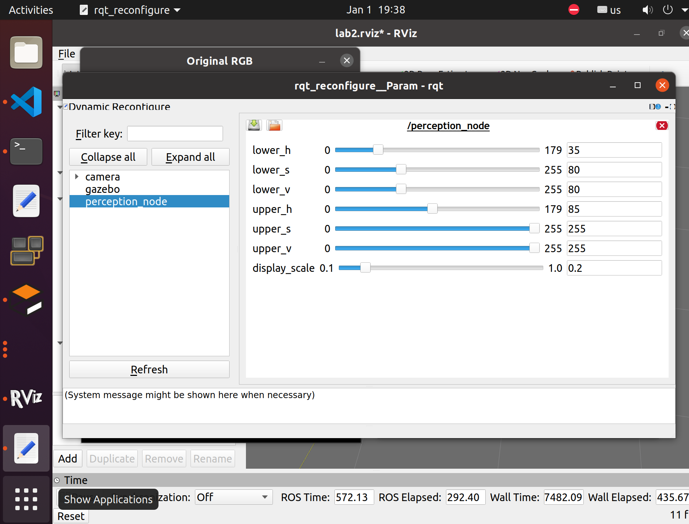


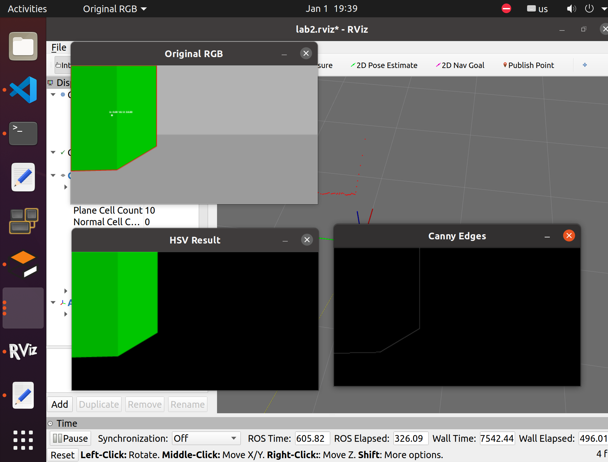

**3.2 Data Visualization in Terminal**


To see the custom messages being published:

```bash
# Terminal 3 
source ~/catkin_ws/devel/setup.bash

# Check the detected object coordinates
rostopic echo /detected_object
```
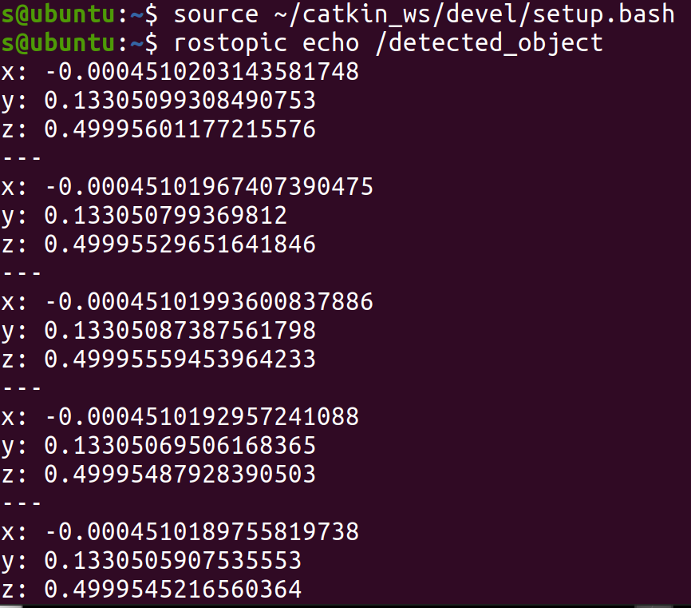


Move the cube, and you will observe the robot moving towards it.


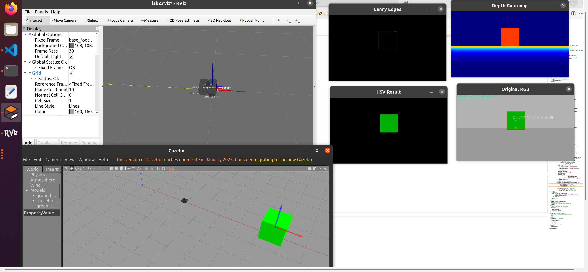

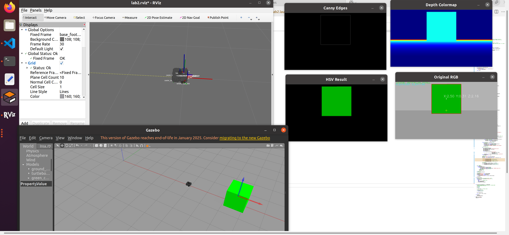

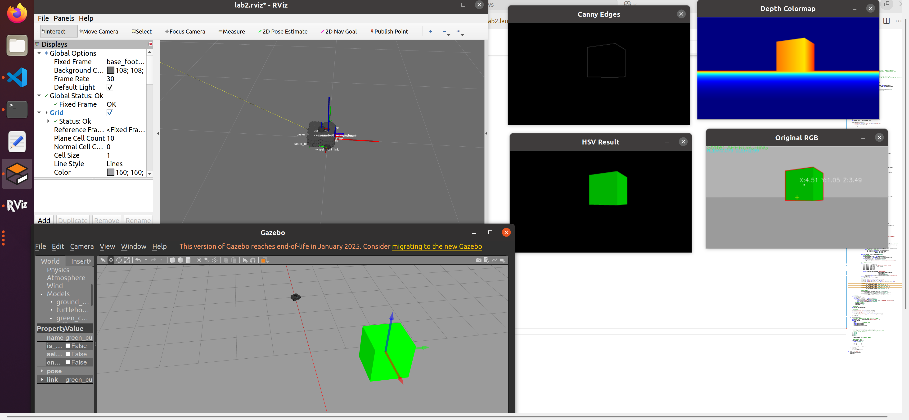

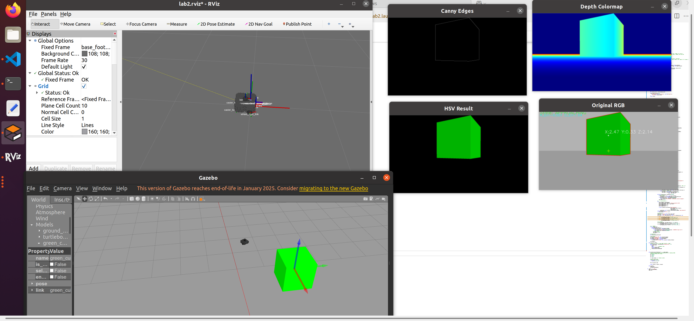

In RViz, the center of mass of the detected object (the pink sphere) can be seen.

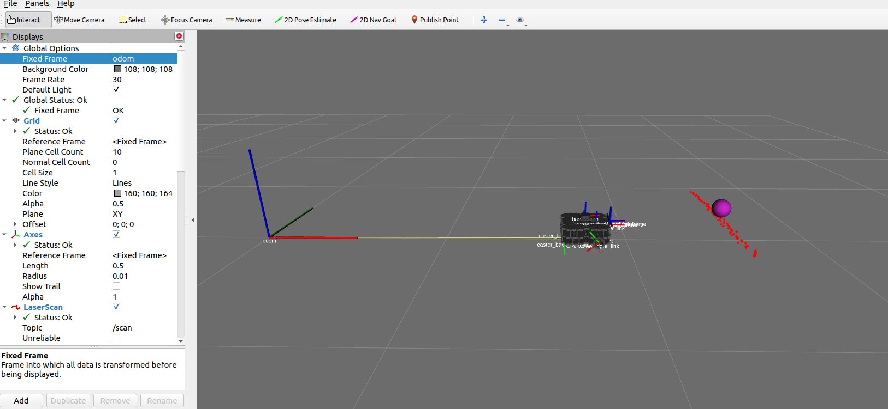

``` bash
# Check the velocity commands being sent to the robot
rostopic echo /cmd_vel
```

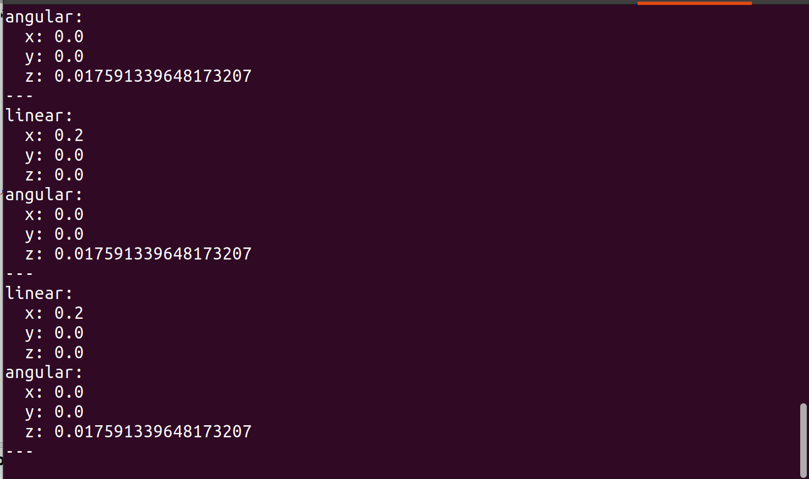


---

### Part 4: 3D Point Cloud Visualization

While RViz is great for ROS integration, Open3D provides powerful Python APIs for programmatic point cloud processing and visualization.

**4.1 Run the Visualizer**
While the simulation (from Part 3) is running:


```bash
# Open a new terminal
source ~/catkin_ws/devel/setup.bash

# Run the Open3D visualizer
rosrun lab2_perception pointcloud_visualizer.py
```

- A new window "3D Point Cloud" will appear.
- **Left Click + Drag**: Rotate the view.
- **Scroll Wheel**: Zoom in/out.
- You should see the 3D reconstruction of the scene in front of the robot.

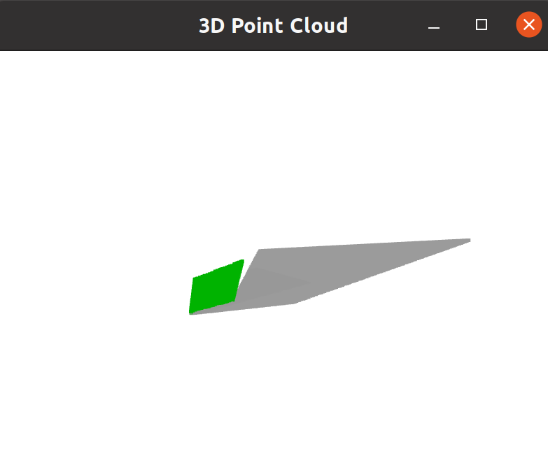

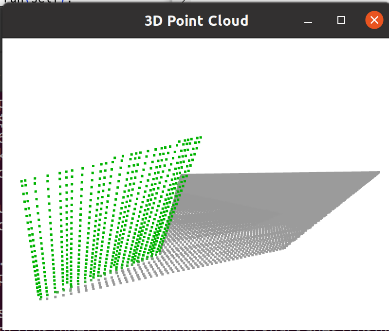


---

### Part 5: Recording and Playback with rosbag

In this part, we will learn how to use **rosbag** to record and replay perception data. This allows us to debug and test perception algorithms offline without requiring a real robot or sensors.

**5.1 Record Sensor Data in Simulation**

First, launch the TurtleBot3 simulation environment.

```
# Source workspace
source ~/catkin_ws/devel/setup.bash
export TURTLEBOT3_MODEL=waffle

# Launch simulation
roslaunch turtlebot3_gazebo turtlebot3_world.launch
```

Open a new terminal and inspect the available topics:

```
# List active topics
rostopic list
```

Identify camera-related topics such as RGB and depth images.

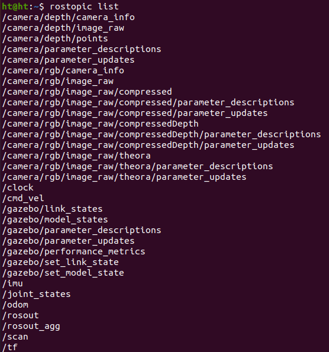

**5.2 Record Camera Data Using rosbag**

Record the camera topics into a rosbag file.

```
# Record RGB and depth images
rosbag record -O camera_data.bag \
/camera/rgb/image_raw \
/camera/depth/image_raw
```

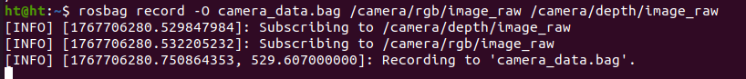

- Let the simulation run for a short period.
- Press **Ctrl + C** to stop recording.

**5.3 Replay Recorded rosbag Data**

Stop the simulation, then replay the recorded data.

```
# Replay recorded data
rosbag play camera_data.bag
```

- The recorded sensor data will now be published as if the robot were running live.

------

**5.4 Visualize Replayed Data in RViz**

While the rosbag is playing, open RViz in a new terminal.

```
# Start RViz
rviz
```

- Add an **Image** display.
- Select `/camera/rgb/image_raw` or `/camera/depth/image_raw`.
- You should see the replayed camera data.

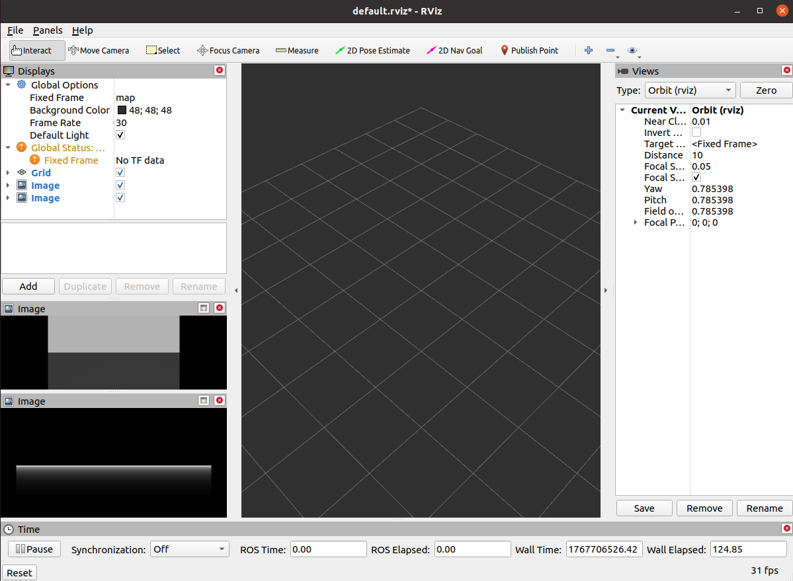

**5.5 Replay Real-World Dataset (KITTI)**

Next, replay a rosbag recorded in a real environment.

```
# Play real-world rosbag
rosbag play kitti.bag
```

**5.6 Visualize Camera and LiDAR Data**

While the rosbag is playing:

1. Open RViz

2. Add displays for:

   - Camera image (1->2->3-a)
   - PointCloud2 (LiDAR) (1->2->3-b)

   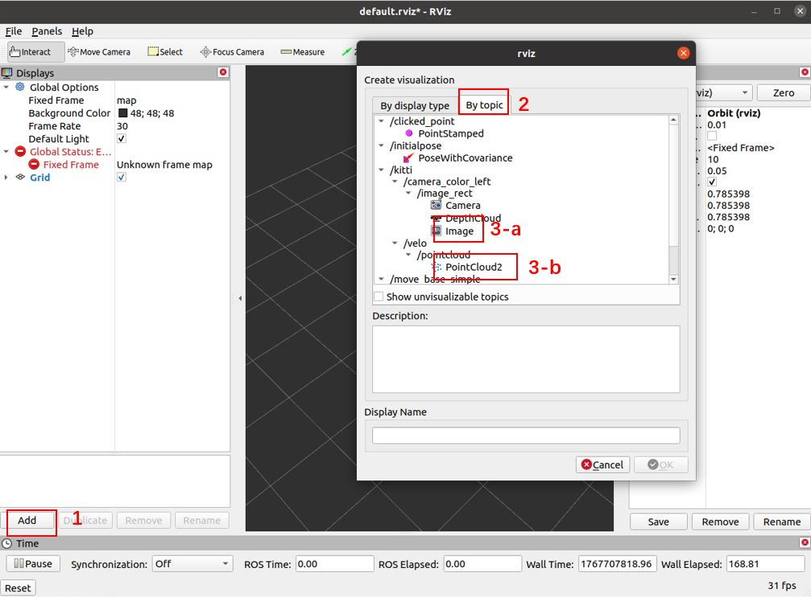

3. Set the **Fixed Frame** to:

```
velodyne
```

- You should now see both camera images and LiDAR point clouds.
- This demonstrates multi-sensor perception using recorded data.

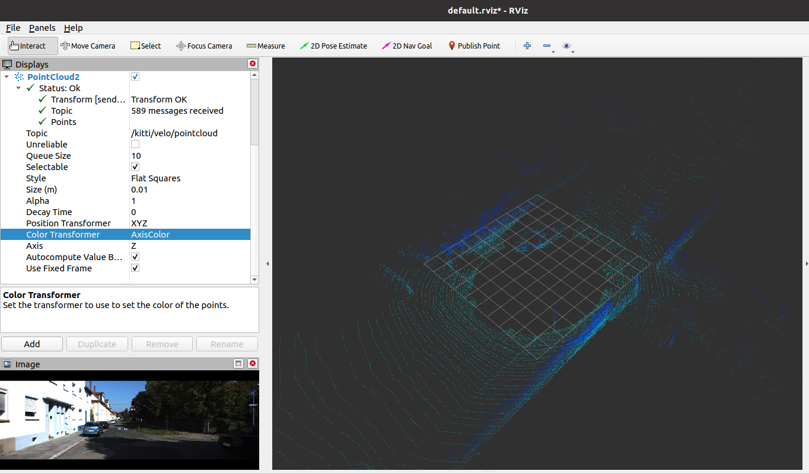


## Conclusion:

In this experiment, we successfully implemented a complete ROS perception pipeline for a mobile robot.

Data Acquisition: We learned how to subscribe to and visualize RGB and Depth data streams from the TurtleBot3 camera using RViz.

Image Processing: By utilizing the HSV color space and OpenCV tools, we effectively isolated specific objects (green cube) from the background and tuned thresholds for robust detection.

3D Localization & Control: We bridged the gap between 2D image pixels and 3D world coordinates using camera intrinsics and depth maps. Through TF transformations, we converted these coordinates into the robot's base frame to implement a closed-loop visual servoing controller, allowing the robot to autonomously track the target.

Visualization: Finally, we explored 3D scene reconstruction using Open3D, verifying the depth data fidelity.

This lab demonstrates the fundamental workflow of robot perception: Sense (Camera) → Perceive (OpenCV/HSV) → Plan/Act (Visual Servoing). These skills form the foundation for more advanced tasks such as SLAM, object manipulation, and semantic scene understanding.