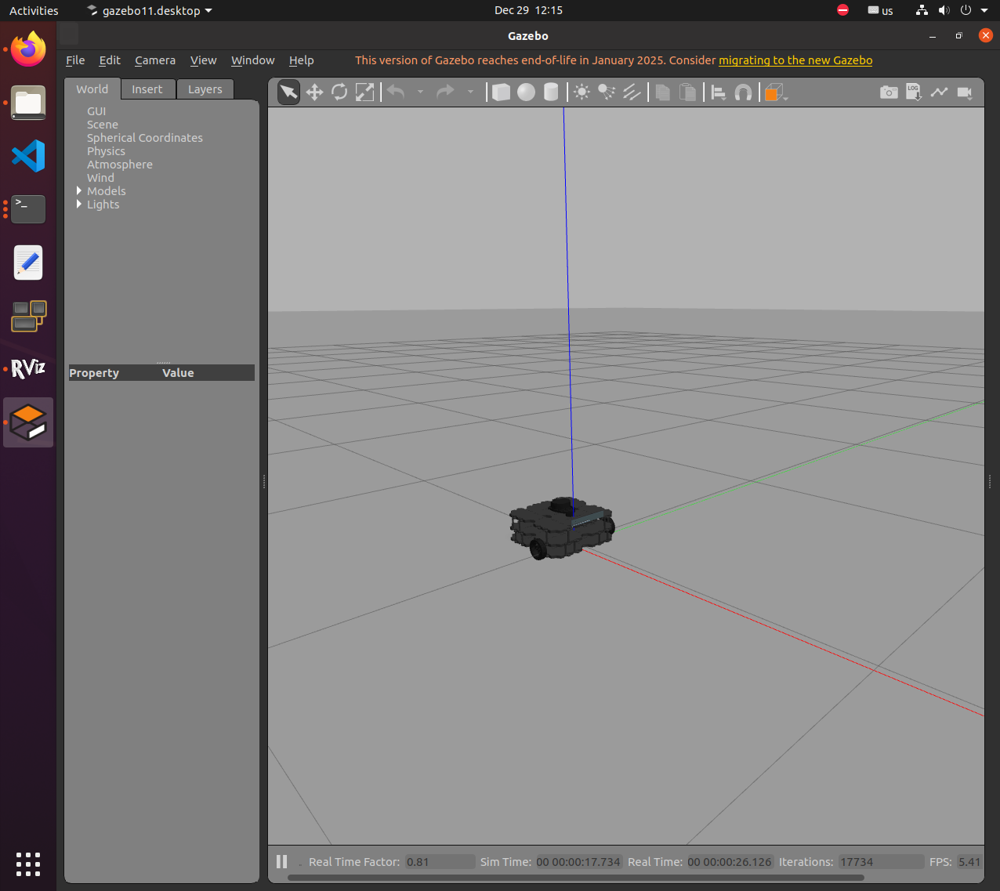
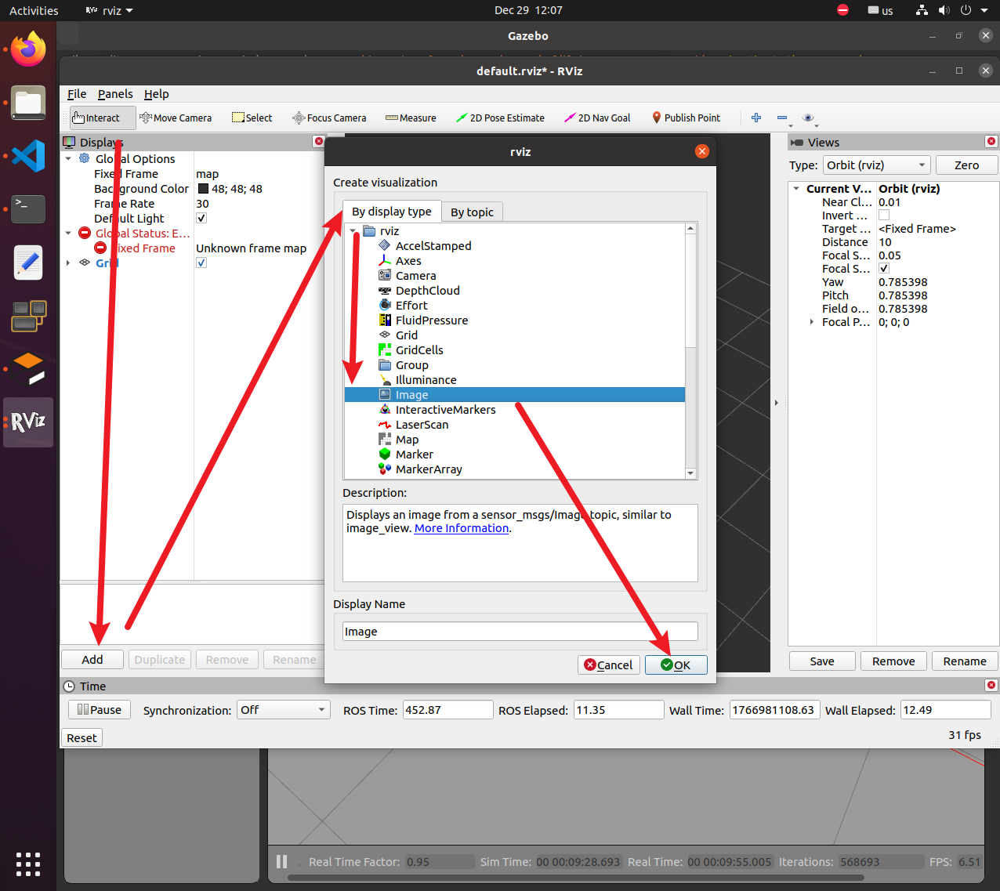
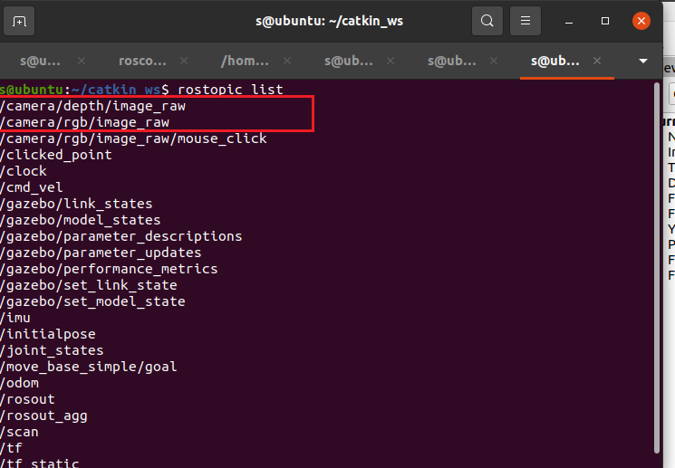
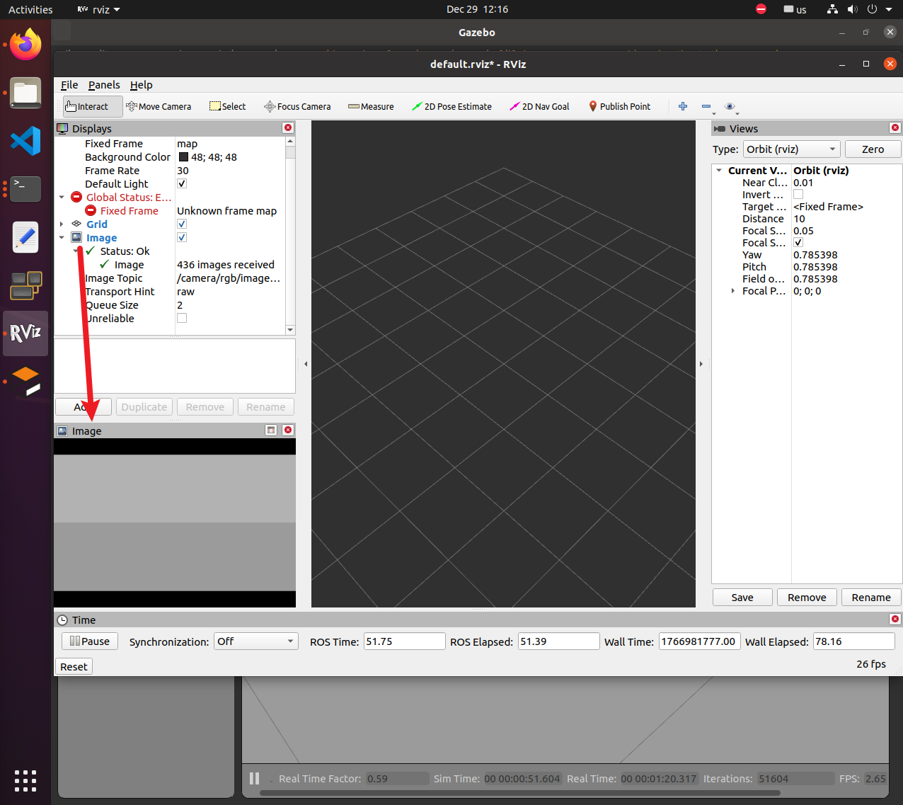
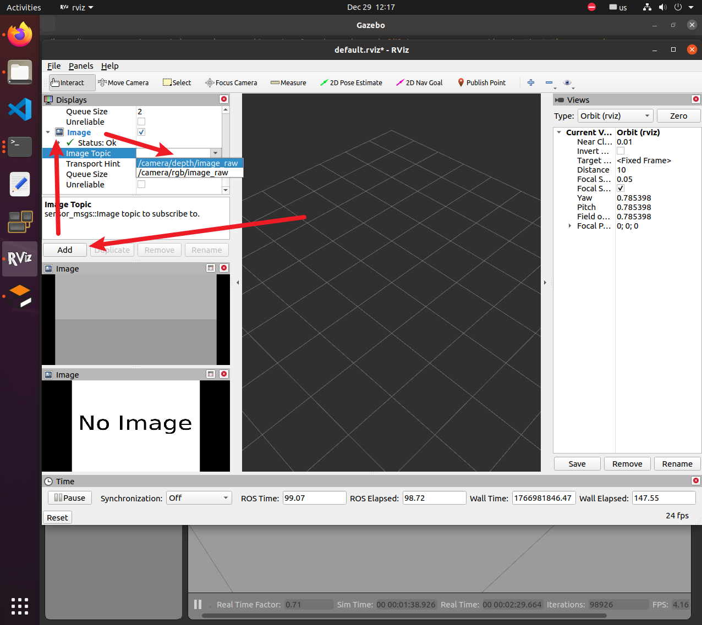
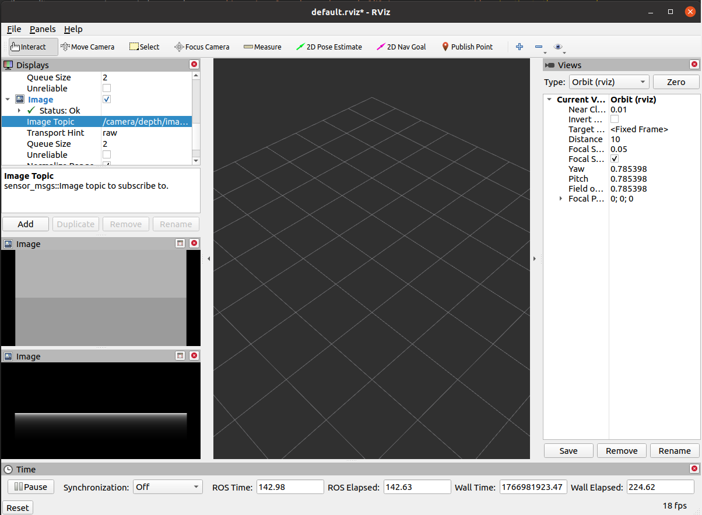
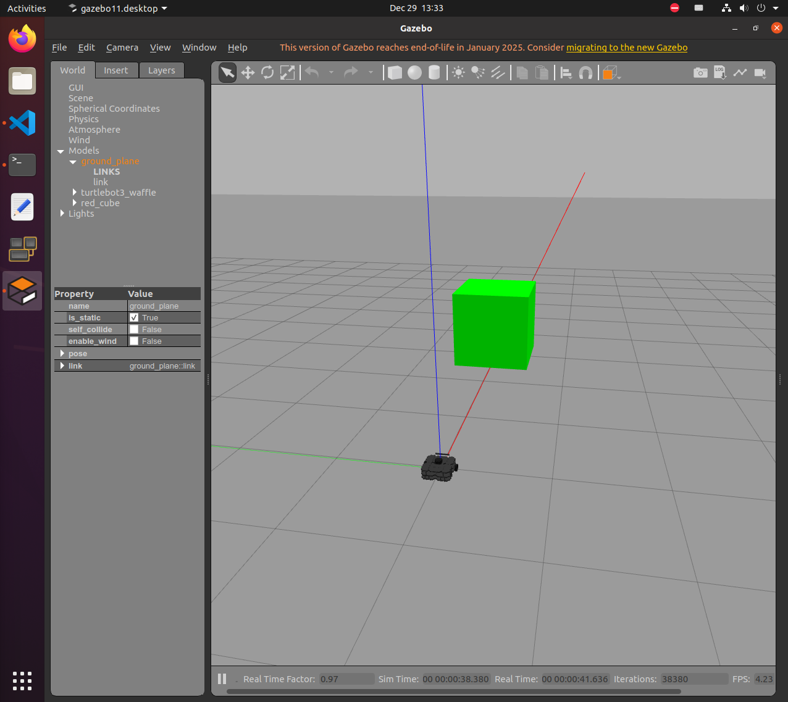

# Lab 2: ROS Perception System Basics — Image Subscription and Processing

## 1. Experiment Objectives

- Learn how to subscribe to and process image data (RGB and Depth) in ROS.
- Master basic image processing techniques using OpenCV: Color Space Conversion (HSV), Object Detection, and Contour Detection.
- Understand how to calculate 3D coordinates of objects using Depth maps and Camera Intrinsics.
- Learn to transform coordinates from the Camera Frame to the Robot Base Frame using TF.
- Implement a basic Visual Servoing control loop to follow a target.
- Visualize 3D Point Clouds using Open3D.

## 2. Prerequisites

- **Hardware**: TurtleBot3 (or simulation), PC with Ubuntu 20.04.
- **Software**: ROS Noetic, Python 3.x, OpenCV, Open3D, `cv_bridge`.
- **Package**: `lab2_perception` (Provided in `src/`).

## 3. Setup and Compilation

First, ensure your environment is set up and the package is compiled.

```bash
# 1. Navigate to your workspace
cd ~/catkin_ws

# 2. Build the package
# We whitelist only this package to speed up compilation
catkin_make -DCATKIN_WHITELIST_PACKAGES="lab2_perception"

# 3. Source the setup script to register the new package
source devel/setup.bash
```

## 4. Step-by-Step Experiment

### Part 1: Basic Image Subscription

Before diving into complex processing, let's verify we can receive images from the camera.

**1.1 Run RGB Subscriber**
This script subscribes to `/camera/rgb/image_raw` and displays the video stream.

```bash
# Terminal 1: Start ROS Master (if not running)
roscore

# Terminal 2: Play a bag file or start a camera simulation (if you have one)
source ~/catkin_ws/devel/setup.bash
export TURTLEBOT3_MODEL=waffle
roslaunch turtlebot3_gazebo turtlebot3_empty_world.launch
```




**1.2 Run rviz to visualize rgb and depth image** 


Open RViz and add image displays for both RGB and depth topics.

``` bash
# Terminal 3: Run RViz
rviz
``` 

In RViz:
Click Add → By display type → Image





Use `rostopic list` to check the camera topic name.



Set the topic to /camera/rgb/image_raw


Add another Image display and set the topic to /camera/depth/image_raw
Adjust the Fixed Frame (e.g., camera_link or base_link) if needed
This allows you to visually inspect both the RGB stream and the depth map in real time.





**1.3 Set obstracle for sensor**


Set a green cube for object detection:

``` bash
source ~/catkin_ws/devel/setup.bash
rosrun gazebo_ros spawn_model \
  -file ~/catkin_ws/src/lab2_perception/demo_images/red_cube.sdf \
  -sdf \
  -model red_cube
```




---

### Part 2: Image Processing Tools (HSV Tuning)

To detect a specific object (like a red block), we need to find the correct HSV (Hue, Saturation, Value) thresholds. We have provided tools to help you with this.

**2.1 Generate Test Images**
First, let's generate some sample images to test our algorithm.

```bash
# Generate dummy images in src/lab2_perception/demo_images/
rosrun lab2_perception generate_images.py
```

**2.2 Tune HSV Thresholds**
Use the tuner tool to find the best values to isolate the red color.

```bash
# Run the tuner tool
rosrun lab2_perception hsv_tuner.py
```

**Instructions**:

1. Use the "Image" trackbar to switch between the generated images.
2. Adjust `H Min`, `S Min`, `V Min`, etc., until only the desired object is white in the middle mask window.
3. **Record these values**. You will need them for the main perception node. (Default values for red are already set in the code).

---

### Part 3: Integrated Perception & Visual Servoing

This is the core of the experiment. We will run the TurtleBot3 simulation in Gazebo. The robot will use its camera to detect a red object, calculate its 3D position, and drive towards it.

**3.1 Launch Simulation and Perception Node**

We have prepared a launch file that starts:

- Gazebo with TurtleBot3.
- The `perception_node` (performs detection and control).
- RViz for visualization.

```bash
# Close previous terminals if needed, then run:
roslaunch lab2_perception lab2.launch
```

**3.2 What to Observe**

1. **Gazebo**: You should see the TurtleBot3 in an empty world.
   - *Action*: Insert a Red Box (or Cylinder) in front of the robot.
   - Go to the "Insert" tab in Gazebo -> `http://gazebosim.org/models/` -> `Unit Box`.
   - Right-click the box -> `Edit model` -> Change color to Red (or just assume the default code detects the generated samples if you can spawn a red object).
   - *Alternative*: If you cannot spawn a red object easily, the code defaults to looking for "Red". Ensure you have something red in the camera view.
2. **OpenCV Windows**:
   - **Original RGB**: Shows the camera view with the detected object circled and its (X, Y, Z) coordinates displayed.
   - **HSV Result**: Shows the binary mask of the detected color.
   - **Canny Edges**: Shows edge detection results.
3. **Visual Servoing**:
   - If a red object is detected, the robot should rotate to face it and move closer until it is 0.5m away.

**3.3 Data Visualization in Terminal**
To see the custom messages being published:

```bash
# Open a new terminal
source ~/catkin_ws/devel/setup.bash

# Check the detected object coordinates
rostopic echo /detected_object

# Check the velocity commands being sent to the robot
rostopic echo /cmd_vel
```

---

### Part 4: 3D Point Cloud Visualization

We can also visualize the depth data as a 3D Point Cloud using the Open3D library.

**4.1 Run the Visualizer**
While the simulation (from Part 3) is running:

```bash
# Open a new terminal
source ~/catkin_ws/devel/setup.bash

# Run the Open3D visualizer
rosrun lab2_perception pointcloud_visualizer.py
```

**Instructions**:

- A new window "3D Point Cloud" will appear.
- **Left Click + Drag**: Rotate the view.
- **Right Click + Drag**: Pan the view.
- **Scroll Wheel**: Zoom in/out.
- You should see the 3D reconstruction of the scene in front of the robot.

---

### Part 5: TF Coordinate Transformation

The `perception_node` automatically broadcasts the position of the detected object in the robot's coordinate system.

1. **RViz**:
   - The launch file opens RViz.
   - Ensure "TF" is checked in the display list.
   - You can visualize the relationship between `camera_rgb_optical_frame` (where the camera sees) and `base_footprint` (the robot's center on the ground).
   - The code calculates the object's position in `base_footprint` and logs it (check the node output).

## 5. Summary of Key Commands

| Task                      | Command                                                       |
| ------------------------- | ------------------------------------------------------------- |
| **Build**           | `catkin_make -DCATKIN_WHITELIST_PACKAGES="lab2_perception"` |
| **Generate Images** | `rosrun lab2_perception generate_images.py`                 |
| **HSV Tuner**       | `rosrun lab2_perception hsv_tuner.py`                       |
| **Launch Lab**      | `roslaunch lab2_perception lab2.launch`                     |
| **3D Visualizer**   | `rosrun lab2_perception pointcloud_visualizer.py`           |
| **Check Topics**    | `rostopic echo /detected_object`                            |

## 6. Troubleshooting

- **"ModuleNotFoundError: No module named 'open3d'"**: Install Open3D via pip:
  ```bash
  pip install open3d
  ```
- **Robot spins in circles**: Check if the red object is visible. If not, the robot stops (or keeps last command depending on logic). Ensure the HSV thresholds match your object.
- **Camera not working**: Ensure Gazebo is running and not paused.
